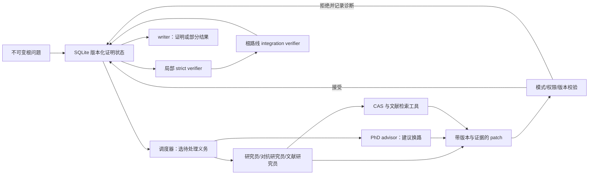

# Albilich：可干预的证明状态与研究路线管理

## 定位与阅读入口

Albilich 是围绕**非形式化研究阶段**设计的多角色 harness，不是单个基础模型，也不是 Lean 一类形式证明内核。它把一个题目和逐渐生成的命题、证明路线、推理步骤、证据、失败及待补义务存在有版本的 SQLite 证明状态中；人可查看和改变策略。输入是数学问题文件，输出可能是经系统内部检查的证明、反例或说明剩余障碍的部分结果。具体案例见 [Kourovka 21.142](../dossiers/2026-albilich-group-theory.md)。[系统论文 §1、§3](https://arxiv.org/html/2607.27705v1)、[固定仓库 README](https://github.com/uw-math-ai/albilich/blob/36c648cb3bc8d550fbe5c4035f177ef4c0a5f1c7/README.md)。

**学习价值高的部分是状态接口**：研究员提出 `claim`（断言）、`route`（证明路线）和 `inference`（由前提到结论的一步）；缺失假设或未证推理形成 `debt`。研究员不能给自己的数学断言盖验证章；局部检查与根命题的完整集成分开。这个分工可以借鉴为管理原则，但系统内部的 `informally_verified` 仍是 LLM 审读结论，不自动等于数学证明。[系统论文 §3.1–3.4](https://arxiv.org/html/2607.27705v1#S3)。

## 版本与来源

|用途|已读原始来源与定位|版本、日期|可以据此说明什么|缺口|
|---|---|---|---|---|
|论文架构|[系统论文 §3](https://arxiv.org/html/2607.27705v1#S3)，特别是 Proof-State Representation、Controlled State Updates、Verification、Task Scheduling、MCP|arXiv `2607.27705v1`，2026-07-30|设计语义、角色权限与论文的实验报告|不能仅凭设计推断每次运行具体步骤|
|21.142 历史运行|[固定实验目录](https://github.com/uw-math-ai/albilich/tree/36c648cb3bc8d550fbe5c4035f177ef4c0a5f1c7/experiments/kourovka/21.142)：`problem.md`、`report.md`、`metrics.json`、`evidence/`、`SHA256SUMS`|运行 2026-07-14，归档快照 commit `36c648c…`|确切输入、结果报告、选出的证明/验证/顾问工件及汇总资源|原始 child-session 全日志与原生 SQLite 未公开；报告提到的运行代码短 SHA `bf52f5d` 在当前公开仓库 API 中未能解析|
|当前公开实现|[固定仓库 README](https://github.com/uw-math-ai/albilich/blob/36c648cb3bc8d550fbe5c4035f177ef4c0a5f1c7/README.md)，`agents/generation/phase2/`|`36c648cb3bc8d550fbe5c4035f177ef4c0a5f1c7`，2026-09-07|现在公开的接口、文档和代码结构|9 月实现明显扩展；不可倒填为 7 月案例原设置|
|档案数值自审|[final-paper 数据索引](https://github.com/uw-math-ai/albilich/blob/36c648cb3bc8d550fbe5c4035f177ef4c0a5f1c7/experiments/aaai27-final-paper/README.md)|同一 commit|哪些实验数字有归档支撑、哪些不符|索引本身是项目自审，不是数学证明|

本批直接阅读 HTML、公开源码和精选归档，未保存 PDF；因此没有本地 PDF 哈希。逐项来源收据在 [Albilich 扩充记录](../references/notes/2026-09-20-albilich-expansion.md)。

## 架构：把研究过程变成可追踪状态

论文用 $q_\star$ 表示不变的根问题，以 $G_t=(C_t\dot\cup R_t\dot\cup I_t,\Gamma_t)$ 存储命题、路线、推理和依赖边；另存 proof debts、文献卡、证明/CAS工件、patch 与事件及资源度量。[论文 §3.1，式 (1)](https://arxiv.org/html/2607.27705v1#S3.SS1)。这使“已经局部验证”与“已经连到根问题”成为两个不同事实。

每次 agent 会话只接收目标及其相关依赖子图，而非把数据库全部塞入上下文。它基于修订号提交结构化 patch；校验提交角色、引用对象、证据、schema 和版本，原子写入，拒绝的 patch 留事件记录。过期会话结果只在目标及依赖闭包未改变时才可能重新考虑。[论文 §3.2–3.3，式 (2)–(3)](https://arxiv.org/html/2607.27705v1#S3.SS2)。当前公开实现可从 [store.py](https://github.com/uw-math-ai/albilich/blob/36c648cb3bc8d550fbe5c4035f177ef4c0a5f1c7/agents/generation/phase2/store.py)、[patches.py](https://github.com/uw-math-ai/albilich/blob/36c648cb3bc8d550fbe5c4035f177ef4c0a5f1c7/agents/generation/phase2/patches.py)、[scheduler.py](https://github.com/uw-math-ai/albilich/blob/36c648cb3bc8d550fbe5c4035f177ef4c0a5f1c7/agents/generation/phase2/scheduler.py)读取；这些是 9 月快照，不证明 7 月运行的逐项细节。

## 角色、路线与停止

|角色|论文规定的职责|能否改变数学验收状态|
|---|---|---|
|Researcher、adversarial researcher|分别构造和攻击命题，提供证明、反例候选、CAS工件|不能|
|Literature researcher|记录原文命题、位置、假设与当前目标的接口|不能|
|PhD advisor|看到停滞、多路线共用债务、中心结论被反驳时重排优先级或提出新归约|不能|
|Strict verifier|检查有界证明包的前提、量词、分支、引用和计算接口|可标局部 `informally_verified`|
|Integration verifier|检查已验推理能否连到不变根问题，结论关系是相同、等价还是更强|可集成路线|
|Counterexample validator|核候选反例满足假设并确实反驳结论|可接受反驳|
|Writer、scheduler|分别输出读者稿和选下一任务|不能|

见 [论文 §3.2 角色表、§3.4](https://arxiv.org/html/2607.27705v1#S3)。调度器优先处理卡住根路线的义务，考虑多路线共享程度、已有会话、成本及校验预算；advisor 在一段时间无根相关进展、重复被驳回或核心命题被否定时介入。失败路线和被取代命题继续保存在历史中。若所依赖命题失去验证状态、推理被替换或出现 blocking debt，已集成路线应被重新打开。[论文 §3.4–3.5](https://arxiv.org/html/2607.27705v1#S3)。

论文把“全部局部检查通过且存在通向根命题的已集成路线”作为内部完成条件。特定案例有自己的预算和人为停止；不能把架构中的完成条件写成所有运行都在同一预算下成功。当前 README 另说连续三个仅有 rejected patch 的 execution wave 会进入 `awaiting_human`，这是较新快照的操作规则。[固定 README Quickstart](https://github.com/uw-math-ai/albilich/blob/36c648cb3bc8d550fbe5c4035f177ef4c0a5f1c7/README.md)。

## 验证与工具的可信范围

文献搜索返回候选；literature researcher 需回原文记录定理位置、假设、符号转换和需要的推论，strict verifier 再查接口。CAS 由 MCP 路由至 SageMath、GAP、Macaulay2 或 Singular；归档应保存计算问题、有限范围、代码、输出、后端版本。**论文明确说 verifier 阅读 CAS transcript 而不重新执行计算**；故计算正确性仍倚赖 transcript 和后续独立复核。有限计算不能直接证明全称断言。[论文 §3.5](https://arxiv.org/html/2607.27705v1#S3.SS5)。

`informally_verified` 是系统内部语言模型验收；论文说正式后端的 `formally_verified` 在论文版本尚留待后续实现。[论文 Related Work、§3.4](https://arxiv.org/html/2607.27705v1#S2)。归档自审也警告：历史结果不是独立评分的总体性能或因果证据。[固定 README Experiment data policy](https://github.com/uw-math-ai/albilich/blob/36c648cb3bc8d550fbe5c4035f177ef4c0a5f1c7/README.md)。不能用“verifier passed”代替对群论引用、同余/例外小秩、所有参数分支的数学审稿。

## 可公开复用的入口

- [官方仓库固定快照](https://github.com/uw-math-ai/albilich/tree/36c648cb3bc8d550fbe5c4035f177ef4c0a5f1c7)、[Apache-2.0 LICENSE](https://github.com/uw-math-ai/albilich/blob/36c648cb3bc8d550fbe5c4035f177ef4c0a5f1c7/LICENSE)、[问题输入实例](https://github.com/uw-math-ai/albilich/blob/36c648cb3bc8d550fbe5c4035f177ef4c0a5f1c7/experiments/kourovka/21.142/problem.md)。
- 当前 README 的 `phase2.cli init/attempt` 是公开入口；固定快照说明 Linux、`bubblewrap`、`prlimit`、相应 Codex CLI，论文/PDF 输出另需 TeX。2026-09 快照的默认模型为 `gpt-6-astra`、`xhigh`；**21.142 的 2026-07 运行是 `gpt-5.6-sol`、`xhigh`**。两者不能混写。[固定 README Quickstart](https://github.com/uw-math-ai/albilich/blob/36c648cb3bc8d550fbe5c4035f177ef4c0a5f1c7/README.md)、[案例 metrics.json](https://github.com/uw-math-ai/albilich/blob/36c648cb3bc8d550fbe5c4035f177ef4c0a5f1c7/experiments/kourovka/21.142/metrics.json)。
- [实验归档](https://github.com/uw-math-ai/albilich/tree/36c648cb3bc8d550fbe5c4035f177ef4c0a5f1c7/experiments)保存 prompt、报告、精选证明和 verifier 工件及 `SHA256SUMS`，但明确排除原始 child-session 日志、临时 SQLite 和本地绝对路径。成本公开的是 token、child-session 时间等资源，不是可移植的美元费用或完整失败样本。
- 本项目**只读**公开材料；未安装、未运行 Albilich，也未用其设置接入其他数学项目。复用前先检查精确代码版本、prompt、模型可用性、CAS 版本和日志是否构成可审计闭环。

## 从系统学什么，以及证据限度

|来源中的实际做法|解决的问题|适用前提|失败风险|效果证据|待检验迁移假设|
|---|---|---|---|---|---|
|命题/路线/推理图与显式 debts|长程工作中分清已做与未做、避免同一缺口反复隐没|可把研究问题拆成准确局部义务|图状态一致但数学内容仍可错；债务闭合可能不充分|论文 §3；21.142 归档有路线与债务|对 ODE 全局论证能否减少遗漏参数分支，未测试|
|研究员、advisor、局部 verifier、集成 verifier 权限分离|避免提出者自行认定完成，避免局部引理冒充主定理|审查者有独立上下文与明确验收接口|同一模型偏差、共同引用错误、根命题语义错配|21.142 一对 adviser 消融：有 advisor 80 sessions 达内部完成；无 advisor 110 sessions 停止时未完成，单次配对不构成普遍因果结论|何时值得增加 advisor 尚待领域内对照|
|来源卡和 CAS transcript 绑定到命题|追踪计算、引用怎样支持数学句子|证据保留输入、范围、版本及推论接口|verifier 未重算，引用原文适用性可能错|论文 §3.5；归档有若干计算、来源适配工件|对符号计算密集问题是否有净收益尚未测定|
|依赖改变时撤销集成|修复上游后防止旧下游继续被当作证明|依赖边确实覆盖全部承重前提|漏建依赖会使撤销不传播|论文 §3.4、当前代码接口|能否在自然语言证明中完整提取依赖仍未知|

数值报告要单独审查。论文称 RealMath 有 CAS 的十题达到内部 `solved_final`，但人工比对仅九题明确匹配，一题等价性未闭合。更严重的是固定仓库的[论文数据自审](https://github.com/uw-math-ai/albilich/blob/36c648cb3bc8d550fbe5c4035f177ef4c0a5f1c7/experiments/aaai27-final-paper/README.md)称未找到摘要“无 CAS 9/10”对应归档；17.91 CAS-on 归档为 **5.250897M** tokens，论文详细表为 **6.784M**，且 on/off 历史 prompts/搜索设置不完全相同。因此当前公开证据不足以支持“单独开启 CAS 使 token 下降 32%”的受控因果结论。两次尝试本来均未解决根问题。

## 更新入口

最优先补充 21.142 的原始会话/状态快照和运行 commit，逐个复核承重群论引理及引用，并比较归档报告与人类修订的[数学论文 arXiv:2608.00703v1](https://arxiv.org/html/2608.00703v1)。公开仓库存在内容哈希清单，但“工件字节可校验”“内部验证通过”“命题数学上正确”是三个不同层级。本项目目前只达到公开工件与论文的定向阅读，不能给群论成果盖独立 `PROVED` 标签。
