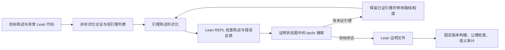

# Aristotle：自然语言规划与 Lean 证明搜索结合的系统

> 阅读定位：先读本文的“输入、输出与架构”，再读 [Erdős #728 案例](../dossiers/2026-erdos-728-aristotle.md)。本文讲 Aristotle **作为系统**的公开机制；该案例的 GPT-5.2 Pro 输入、人工操作和 Alexeev 简化复跑是**案例配置**，不能倒填为每次 Aristotle 运行的默认做法。证据记录见 [本批形式化来源审计](../references/notes/2026-09-20-formal-source-audit.md)。

## 身份、目标与版本

Aristotle 是 Harmonic 的数学证明系统，不是基础聊天模型，也不是 Lean kernel 本身。2025 年系统论文将它拆成：①在 Lean 证明状态中逐步搜索的 prover；②提出自然语言证明及辅助引理、将引理形式化并利用 Lean 反馈修正的外层流程；③处理几何题的 Yuclid 引擎。前两项最接近研究数学中“先找有用引理，再把证明缺口逐个关闭”的工作。2025 年 IMO 测试由人手工翻译题目陈述，辅助引理由系统形式化；论文报告五道题的形式化解答，不能据此推断它会自行准确形式化所有开放问题。[系统论文 §2–3.1](https://arxiv.org/pdf/2510.01346v2)

| 时间与来源 | 可确定内容 | 不可倒填的内容 |
| --- | --- | --- |
| 2025-10 系统论文 arXiv:2510.01346 | 搜索、引理循环、Yuclid 的论文描述；IMO 2025 的公开 Lean 答案 | 论文未公开完整训练、权重、服务端搜索实现 |
| 2026-01 Erdős #728 运行 | GPT-5.2 Pro 提供非形式化论证，Aristotle 产出 Lean 证明；Alexeev 再运行简化 | 无逐轮 API 请求、内部搜索树、精确模型版本；不能套用 2026-06 SDK 行为 |
| 2026-06 `aristotlelib` 2.1.0 | 官方维护的 Python CLI/API 客户端公开，支持提交 Lean 项目及文档形式化 | 当前 SDK 可用不说明 2026-01 使用相同端点或模型 |

版本锚点：[系统论文](https://arxiv.org/abs/2510.01346v2)、[Harmonic 的公开 IMO 证明仓库](https://github.com/harmonic-ai/IMO2025)、[Harmonic 维护的 PyPI 项目及发布日期](https://pypi.org/project/aristotlelib/)。服务的部署版本、底层模型权重与 2026-01 历史快照未公开；本档案只介绍论文所述机制和当前可见接口。

## 输入、输出与架构

普通输入是 Lean 项目或含 `sorry` 的 Lean 代码；可有自然语言题目或已有论证作为参考。Lean 文件中的 **statement** 决定机器检查的目标，文字叙述本身不产生形式证书。输出是 Lean 源文件或证明文本，只有在固定 Lean/Mathlib 环境中构建通过，并检查所用公理及 statement 语义后，才可把相应形式命题视作已机器验证。[系统论文 §2.1，尤其 pp.2–3](https://arxiv.org/pdf/2510.01346v2)

具体分工见论文 [§2.1](https://arxiv.org/pdf/2510.01346v2)：搜索单元以 Lean goal、局部上下文和历史动作作为状态，模型提出 tactic/代码动作并估计后续可证性；状态合并后构成搜索图，PUCT 类策略选择分支，多目标动作须让全部子目标闭合。Lean REPL 给出语法、类型和证明状态反馈。论文 [§2.2、图 2](https://arxiv.org/pdf/2510.01346v2) 的外层流程先起草非形式化证明，拆成短引理，形式化引理陈述，利用 REPL 报错修正，再对引理与目标运行搜索。失败后保留已证明的引理，补充或改写尚未解决的引理，可同时改变策略和拆分粒度。

论文所述搜索会在提示中携带当前动作历史；辅助引理成为随后搜索的上下文。这里可核的“记忆”是本次搜索的状态、动作历史及已证引理。在**本次所查系统论文与公开接口材料**中，未见足以确认跨项目持久事实图、自动文献检索数据库、通用数学研究状态管理或人工审批门的描述；此判断仅限已查资料，不推及未查版本或内部实现。论文还有 test-time training 描述（§2.1.7），属于大规模部署时的模型适应，不等于每个公开用户请求都会触发。[系统论文 §2.1.1–2.2.2](https://arxiv.org/pdf/2510.01346v2)

## 一个可检查的微观步骤

系统论文 p.2 的简单示例从 `P ∧ (Q ∨ R) → P ∧ Q ∨ P ∧ R` 出发。`cases` 分裂析取后产生两项 Lean 子目标；它们可以走不同 tactic 路线，但只有两个子目标都闭合，原动作才算成功。这解释了论文所谓 AND/OR 搜索，尤其是为什么“某个引理的一个分支通过”不能当作整条证明通过。它是**系统论文的教学示例**，并非 Erdős #728 的真实运行日志。[系统论文 Figure 1 与 §2.1.1–2.1.3](https://arxiv.org/pdf/2510.01346v2)

## 模型角色、工具与停止条件

- **非形式化规划模型**：生成证明草图、短引理及修订建议；论文没有完整公布权重、全部 prompts 或服务端代码。2025 IMO 实验报告使用超过 200B 参数的搜索模型、多并行 lemma pipelines 与多轮反馈，但这不是 #728 案例的可核配置。[系统论文 §3.1，p.8](https://arxiv.org/pdf/2510.01346v2)
- **形式化与搜索模型**：生成 Lean 陈述和 tactic；其动作要由 Lean 环境反馈。自然语言注释有助于继续搜索，但注释不是被证明的对象。[系统论文 §2.1.4、§2.2.1](https://arxiv.org/pdf/2510.01346v2)
- **Lean/Mathlib**：核查给定形式 statement 的证明项，不能替人判定它是否忠实表达原自然语言命题。`sorry`、自定义公理、过强定义或过弱陈述可能使“编译成功”的解释失真。
- **Yuclid**：几何题专用的演绎数据库与代数推理引擎；#728 是数论题，无证据表明该部件参与。[系统论文 §2.3](https://arxiv.org/pdf/2510.01346v2)

系统论文给的是“搜索闭合或资源耗尽后修订引理”的过程；单次请求的预算、超时、失败返回格式与用户审批规则，不能从论文还原。对研究使用者，合理的停止标准应由外部项目另定：目标 Lean declaration 闭合、来源版本固定、公理与 statement 对照完成；这是一项**学习建议**，非 Harmonic 宣称的默认验收。

## 当前公开使用入口与成本边界

截至 2026-09-20，Harmonic 维护的 [`aristotlelib` 2.1.0 PyPI 页面](https://pypi.org/project/aristotlelib/)写明 Python ≥3.10、API key 和 `submit`（Lean 项目中补 `sorry`）、`formalize`（文档转 Lean）两个 CLI 入口，也列出项目查询与下载命令。历史版 `aristotlelib` 0.5.1 于 2025-11-25 已存在；不能据当前 CLI 推断 #728 的实际命令。本项目只读取说明，未注册、上传文件、安装 SDK 或调用服务。用户将来若要试用，须另核当时的服务文档、账单、上传内容与数据许可。

论文、PyPI 与当前公开页面没有给出可用于重放 #728 的完整 prompts、seed、实例数、GPU 小时、token/费用账单和服务端版本。公开的 Lean 工件可以单独审核，却不能按原历史条件重跑 discovery。`aristotlelib` 是客户端，不等于 Aristotle 模型/服务器开源；[Harmonic GitHub 组织](https://github.com/harmonic-ai)公开 IMO 工件和若干其他仓库，未发现完整服务端实现。

## 验证链与失败边界

形式验证的强处是：**指定的 Lean 陈述**若在给定环境中无占位证明地由 kernel 接受，就不依赖 LLM verifier 的主观判断。研究命题仍须独立检查原文与 Lean 陈述之间的量词、参数域、定义、依赖和公理。Aristotle 的外层自然语言模型可能给出错误证明草图；系统论文 §2.2.1 承认草图和引理陈述均常有缺口，依靠 Lean 报错及修订继续工作。[系统论文 §2.2.1–2.2.2](https://arxiv.org/pdf/2510.01346v2)

#728 是一个具体提醒：公开简化版 Lean 文件的两个顶层声明各覆盖论文 Theorem 1 的一部分，不能只见 `#print axioms` 输出便声称整篇论文的最强表述已逐字形式化。详见[案例的 statement 对照](../dossiers/2026-erdos-728-aristotle.md#lean-证书与论文命题的对应)。

## 值得学习的做法及其证据边界

| 实际做法与来源 | 解决的问题 / 前提 | 风险与效果证据 | 待检验推测 |
| --- | --- | --- | --- |
| 自然语言证明 → 短引理 → Lean 陈述 → 搜索；[§2.2](https://arxiv.org/pdf/2510.01346v2) | 将大目标拆成可由 tactic 搜索关闭的局部目标；需能准确形式化目标 | 论文报告 IMO 结果，#728 有公开文件；策略贡献与底模贡献未做本案例消融 | 对新研究题的有效引理粒度是否可稳定学习 |
| Lean 状态图与多分支闭合；[§2.1](https://arxiv.org/pdf/2510.01346v2) | 避免把局部成功误认作目标完成；需可靠的 Lean 环境 | 系统论文描述内部算法，但服务器代码与搜索日志不公开 | 面向不同数学领域的搜索预算如何分配最好 |
| 保留已证引理，失败时改写未证部分；[§2.2.2](https://arxiv.org/pdf/2510.01346v2) | 降低重复推导并暴露承重瓶颈；需追踪依赖与 statement 版本 | 原理可见，#728 逐轮日志不足以量化收益 | 是否应把失败路线与外部文献证据纳入同一状态图 |

## 未解决问题与更新触发

1. 完整服务端配置、模型版本、prompt、运行日志和成本披露出现时，重新评估可复现性与贡献归因。
2. 若有 #728 的新 Lean 顶层声明直接对应论文 Theorem 1，核查其环境、公理、定义及文本语义，再更新案例状态。
3. 若官方论文或 SDK 更新，应按发布日期新建版本行，不将新行为倒填到 2026-01 运行。

## 集中复用入口

论文、固定代码版本、配置/工件入口及许可元数据见[来源与复用索引](../references/SOURCES.md)。
