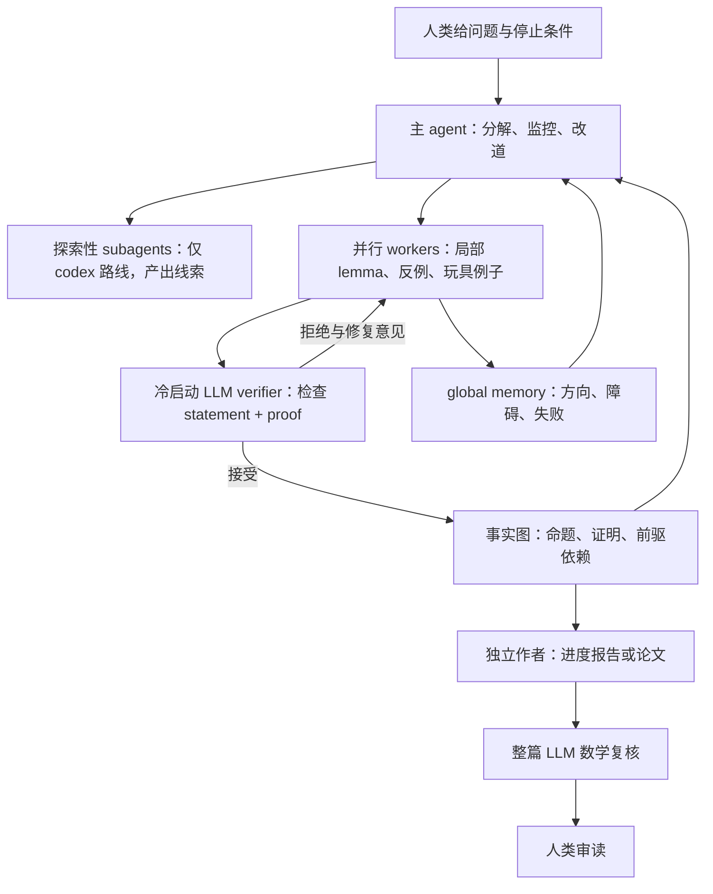

# Danus：以事实图管理长程证明搜索

> **2026-09-20 勘误。** 旧版档案中“YTD 改进版尚未公开”已经过期。官方仓库 [`codex` 分支](https://github.com/frenzymath/Danus/tree/6d92e8d415933ca2ef52fd1a4da73fdfcd418f1c)现公开，README 明言这是解决 YTD 的版本；[2026-08-23 提交](https://github.com/frenzymath/Danus/commit/bbb4fd6848ad8d7024494dcf5f7ac6f283cedbb3)将分支与内部 v3 设计对齐。仍未取得与论文中 5 小时 29 分钟那次运行精确绑定的 commit、原始输入、完整日志和 fact graph，故“实现可读”不等于“历史运行可复现”。下文保留旧观察并作版本修正。

## 当前阅读入口：最新公开版完整教程

**[Danus 全框架教程](danus/FRAMEWORK-GUIDE.md)** 是现在推荐的主入口。本页保留历史版本和案例对照，不要求先读数学成果证明。

2026-09-20 再查官方仓库：默认分支为 `codex`，HEAD 仍是 `6d92e8d415933ca2ef52fd1a4da73fdfcd418f1c`，提交于2026-08-27；正式 latest release `v0.1.0` 更旧。“v3”来自8月23日对齐内部设计的提交，不是当前正式 release 标签。见[版本确认](../references/notes/2026-09-20-danus-latest-version.md)。

最新契约的重点是：主控自己做高层数学思考，管理探索性 Codex subagents 与持久证明 workers 两条通道；30分钟控制检查与4小时复盘属于主控契约；数学采用纯文本推理，禁止执行 CAS、数值实验和形式证明工具。MCP 角色限制不等于操作系统沙箱。完整运行、停止、恢复、写作接口及其来源见教程。

## 系统概述

Danus 不是一个基础大模型，而是面向长程非形式化数学研究的 **agent orchestration system / harness**。它把主协调 agent、并行 proof-search workers、独立上下文 verifier、fact-graph memory、文献检索和论文写作连接成一条长程工作流。

YTD 附录中排版成 `Danus` 后带上标 3 的字符是脚注编号，脚注内容说明那是一个“改进版 Danus”。后来公开的提交说明使用“内部 Danus v3 设计”一语；版本判断应依靠提交和代码内容，不能从论文上标推断。

## 版本对应

| 记录 | 主协调角色 | workers / verifier | strategy | 状态 |
|---|---|---|---|---|
| Danus 论文 v2，2026-07-08 | Claude Code + Claude Opus 4.8 | Codex agents + GPT-5.5 | 低频 GPT-5.5-pro consultation | 论文与公开仓库可查 |
| GitHub `main`，2026-09-20 HEAD 1a2cb99f9b16abb6b82d1bda207ed8a822f12743 | README 描述为 Claude Code 主协调者 | Codex proof core | 与 `codex` 分支相区别 | 公开代码；本项目未运行 |
| YTD 改进版，论文 v1 附录描述 | Codex-based main + GPT-5.6-sol | workers 换 GPT-5.6-sol；另有探索性 Codex subagents，本案例为 3 个 | 移除 GPT-5.5 Pro consultation，由 main 直接做高层数学和全局策略 | 论文中的历史运行版本未精确绑定 commit |
| GitHub `codex`，2026-09-20 HEAD 6d92e8d415933ca2ef52fd1a4da73fdfcd418f1c | Codex 主协调者 | Codex workers + cold-start Codex verifier | 主 agent 形成 `elaboration`、`master_guidance`；可派探索性 subagents | README 声称这是 YTD 版本；当前实现可读，不等于历史运行重放 |

这些配置不能互相替换。尤其不能用当前 GitHub README 推断 YTD 重跑的完整环境，也不能把 YTD 的 GPT-5.6-sol 配置倒填到 Danus 论文的六个早期 case studies。论文中 Danus 后的上标 3 是脚注号；公开提交使用“v3”字样，二者不可仅因排版而等同。

## 架构与数据流

```text
human problem / guidance
          ↓
main agent: plan, decompose, monitor, redirect
          ↓
parallel workers: lemma / example / counterexample / proof route
          ↓
stateless verifier: check submitted statement + proof + cited facts
          ↓ pass
content-addressed fact graph: verified facts + dependency edges
          ↕
global memory: plans, obstacles, attempts, dead ends (not truth)
          ↓ target fact reached
paper writer → whole-manuscript verifier → human review
```

核心不是简单“多开几个 agent”，而是以下组合：

- 每个 worker 聚焦一个局部 claim，降低单次上下文负担；
- worker 的候选必须经过 fresh/stateless verifier 才能进入 fact graph；
- fact graph 是系统内部唯一 truth store，global memory 只保存未验证方向和失败；
- 事实记录依赖边，错误事实可连同其下游依赖一起撤销；
- 主 agent 周期性读取 workers、memory 和 fact graph，改变全局策略；
- 写成线性论文后重新整篇验证，因为从图压缩成 prose 会产生新的拼接错误。

## 模型与角色分工

### Danus系统论文v2

- main agent：Claude Code，底层 Claude Opus 4.8；作者报告它更适合阅读不断增长的日志、memory 和大型 fact graph。
- workers 与 verifier：Codex agents，GPT-5.5。
- strategic consultant：GPT-5.5-pro，低频调用；咨询结果只进入 memory，不进入 fact graph。
- 典型 worker 数：3–9；约一半 `high`、一半 `xhigh`，以换取深度和路线多样性。
- retrieval：继承 Rethlas，通过 Matlas 进行数学文献定理检索。

### YTD使用的改进版Danus

- main agent 和 workers 均改为 GPT-5.6-sol，通过 Codex-based implementation 和单一 API 运行；
- 取消 GPT-5.5 Pro strategy consultation；main agent 自己进行数学思考和全局策略；
- 该重跑使用 3 个 Codex subagents；
- 强化 global strategic reflection，并让 worker 提交更长、更复杂的局部结果。

## 使用方式

从公开说明看，正常使用流程是：

1. 数学家用自然语言给 main agent 一个明确问题，并预先约定停止条件；
2. main agent 分解建设性、反证性、toy-example 等路线，分派给 workers；
3. workers 循环执行“提出 claim 与 proof → verifier 检查 → 按反馈修复”；
4. 通过的 claim 进入 fact graph，未验证的方向、障碍和 dead ends 留在 memory；
5. main agent 定期复盘全局状态，停止或重分配路线；
6. target theorem 或 refutation 成为 verified fact 后，系统生成进度报告或 LaTeX paper；
7. 论文作为新数学工件再次接受整体验证，最后交给人类专家检查。

公开 `codex` 分支的 quickstart 要求 bootstrap 运行时、配置自有后端或 ChatGPT 登录、执行 doctor 检查、启动 verifier service，再连接 Codex 主 agent。仓库建议的自治启动方式会跳过逐操作权限确认，应放在隔离、可丢弃主机上运行。[README quickstart](https://github.com/frenzymath/Danus/blob/6d92e8d415933ca2ef52fd1a4da73fdfcd418f1c/README.md)、[安全文档 §4](https://github.com/frenzymath/Danus/blob/6d92e8d415933ca2ef52fd1a4da73fdfcd418f1c/docs/security-and-trust.md)

本项目只保存说明，不安装或运行 Danus。若未来请求复现实验，必须使用隔离、可丢弃环境，并先冻结版本、费用上限、密钥权限、可写目录和硬停止条件。

## 验证与失败处理

Danus verifier 是隔离上下文中的 LLM verifier，不是 Lean/Coq kernel。其优势在于：检查者与生成者分离、逐 claim 检查、可跟踪依赖、可以级联撤销。其局限同样重要：

- Danus 论文承认 verifier 偶尔会接受跳步；
- verifier 默认引用文献正确，错误引用可能污染事实；
- 多 agent 和多次验证降低错误率，但不构成数学证明或独立同行评审；
- 整篇论文还需重新验证和人类检查，说明 fact-level pass 不能自动传递到成稿。

因此本项目不得把 `Danus verified fact` 翻译为 `PROVED`。它是系统内部的 verifier-gated claim；本仓库在框架介绍中保留这个边界，不默认另做数学审稿。

## 复现条件、成本与安全边界

- 公开版：代码、架构论文、配置模板和基础操作说明可得，但本项目未执行安装或复现实验。
- YTD 改进版：论文当时写“稍后开放”，现在 `codex` 分支已公开；仍缺论文具体运行的冻结提交、完整配置和可复跑工件。
- 成本：使用自带 API keys，workers、verifier、strategy consultation 和长时间并行运行都会消耗外部服务额度；公开说明没有为 YTD 重跑给出完整成本账单。
- 权限：公开 quickstart 的推荐自治模式具有 shell 权限，应视为高权限外部 runtime。
- 安全结论：`DESCRIBE-NOW / DO-NOT-RUN-IN-RESEARCH-REPO / ISOLATED-PILOT-ONLY-IF-EXPLICITLY-AUTHORIZED`。

## 有公开依据的案例

Danus 论文报告六个研究级案例，覆盖代数几何、奇点理论和组合数学；这些是作者团队的 case studies，不是独立基准。YTD 论文则报告改进版 Danus 对原始问题的 fresh run。

关联案例：

- [YTD：AI 工作流与贡献审计](../dossiers/2026-ytd-disproof-ai-workflow.md)

## 可学习的方法

以下设计值得作为独立假设研究，而不是整体采纳结论：

1. 把已验证事实和未验证策略记忆分开；
2. 用依赖图支持长证明的局部上下文和错误撤销；
3. 同时搜索证明、反例、toy model 和失败路线；
4. 使用 fresh verifier，避免生成上下文污染检查；
5. 把“事实图正确”与“论文表达正确”设为两个验证关口；
6. 预先约定停止条件，防止长程 swarm 无界消耗。

尚不能从公开 case studies 推断哪一个组件因果上带来了成功；基础模型升级、test-time compute、领域专家介入和 harness 设计同时变化。

## 证据缺口

- YTD 历史运行的准确代码 tag/commit、prompts、完整 fact graph 和 verifier transcripts；
- 独立团队对 Danus case studies 的重跑；
- 与单 agent、等 token 预算和相同基础模型的受控比较；
- verifier 假阳性率和引用错误在外部数据上的独立评估；
- YTD 重跑的完整费用、失败路线和人工操作日志。

## 原始来源

- [Danus paper, arXiv:2607.06447v2](https://arxiv.org/html/2607.06447v2)，§2.1–2.7、§3、§4，复查于 2026-09-20。
- [Danus `codex` branch at 6d92e8d](https://github.com/frenzymath/Danus/tree/6d92e8d415933ca2ef52fd1a4da73fdfcd418f1c)，复查于 2026-09-20；`main` 同日 HEAD 为 1a2cb99f9b16abb6b82d1bda207ed8a822f12743。
- [YTD preprint arXiv:2608.19301v1 Appendix A](https://arxiv.org/html/2608.19301v1)，复查于 2026-09-20。

## 把接口拆开来学

系统的输入是自然语言数学问题及人类约定的目标和停止条件；输出可以是事实图、面向人的进度报告和 LaTeX 论文。workers 做局部证明搜索；verifier 检查一次提交的命题、证明与所引用事实；main 维护全局路线。论文版 main 每约一至两小时综合 workers、memory 与 fact graph，并可低频向 GPT-5.5-pro 咨询；YTD 的 `codex` 路线移除外部咨询，让 main 直接作高层数学思考。[论文 §2.1、§2.4–2.5](https://arxiv.org/html/2607.06447v2)、[YTD 附录 A](https://arxiv.org/html/2608.19301v1)



事实图是 DAG；新事实须带前驱 ID，方便后续局部检索和错误事实的级联撤销。事实 ID 对问题、前驱、术语、命题及证明内容求 hash，而外部引文不参与 hash。local memory 供 worker 私下记录，global memory 供各角色了解路线，两者均不能作为承重证明前提。[论文 §2.2–2.3](https://arxiv.org/html/2607.06447v2)、[`ARCHITECTURE.md` §3](https://github.com/frenzymath/Danus/blob/6d92e8d415933ca2ef52fd1a4da73fdfcd418f1c/ARCHITECTURE.md)

`codex` 分支的 [`danus/gateway/roles.py`](https://github.com/frenzymath/Danus/blob/6d92e8d415933ca2ef52fd1a4da73fdfcd418f1c/danus/gateway/roles.py) 定义权限：worker 有 `fact_submit`，main 没有，verifier 只读。[`docs/security-and-trust.md` §1–3](https://github.com/frenzymath/Danus/blob/6d92e8d415933ca2ef52fd1a4da73fdfcd418f1c/docs/security-and-trust.md) 说明 `fact_submit` 仅在服务返回 `correct` 时写图，但 verdict 来自 LLM，服务不独立重推证明；这正是系统内部“truth”与数学证明证书的分界。论文也承认 verifier 偶尔接纳跳步或错误外部引文。[论文 §2.5](https://arxiv.org/html/2607.06447v2)

Matlas 定理检索是辅助工具，不保证引用真的适用。成稿另经整篇复核，是因为把事实 DAG 压缩为线性叙述会生成新的“只需证明”式接口和省略步骤。[论文 §2.6–2.7](https://arxiv.org/html/2607.06447v2) 若将来另行审读一次历史运行，可依次核对原始问题、worker 分工、未验证 memory、事实闭包、撤销记录、外部定理和成稿；本项目尚未取得 YTD 原始运行材料来执行这套检查。

公开 `codex` 分支的 [`config/danus.env.example`](https://github.com/frenzymath/Danus/blob/6d92e8d415933ca2ef52fd1a4da73fdfcd418f1c/config/danus.env.example) 给出模型、effort、端口及运行目录默认值；这些**不是**论文历史运行参数。论文未提供 YTD 全额成本账单，运行时长不能换算为价格。公开 [`AGENTS.md`](https://github.com/frenzymath/Danus/blob/6d92e8d415933ca2ef52fd1a4da73fdfcd418f1c/AGENTS.md) 强调 main 自己做高层数学推理，而 [`ARCHITECTURE.md`](https://github.com/frenzymath/Danus/blob/6d92e8d415933ca2ef52fd1a4da73fdfcd418f1c/ARCHITECTURE.md) 和 `docs/concepts.md` 仍有“main does no math”的旧措辞。共同可确认的窄结论是：main 可形成策略和猜想，但没有 `fact_submit`；承重事实须由 worker 经 verifier 入图。本次教程已按最新契约和具体代码解释该漂移，见[第3、6节](danus/FRAMEWORK-GUIDE.md)。

## 方法学习卡

| 来源中的做法 | 对应难题、适用前提 | 风险与现有证据 |
|---|---|---|
| 事实图与依赖撤销 | 长证明的局部积累；前驱须标全，命题粒度要可核验 | 六案例和 YTD 附录给出使用实例，但无等预算消融；LLM pass 仍可错。 |
| 已核验事实与策略 memory 分离 | 防止失败思路悄悄变成后续引理 | 权限结构可读；错误引文仍可能进入事实图。 |
| 并行证明/反例、周期改道 | 允许多个路线竞赛，减少单一路线卡死 | 费用和协调成本高；未证明比同模型同预算单 agent 更好。 |
| fresh verifier 与成稿后二次检查 | 降低自我检查偏差与文字拼接错误 | 两关都是 LLM；需原文、人类和必要时 formal kernel 独立核查。 |

实际访问记录和未读边界见 [2026-09-20 来源审计](../references/notes/2026-09-20-danus-source-audit.md)。

## 集中复用入口

论文、固定代码版本、配置/工件入口及许可元数据见[来源与复用索引](../references/SOURCES.md)。
