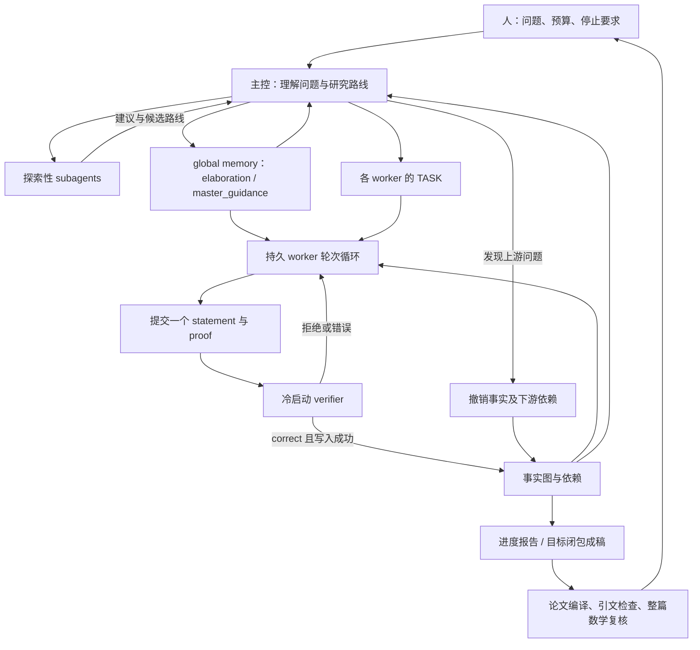

# Danus 最新公开版全框架教程：把并行探索变成可追踪的研究积累

核查日：2026-09-20。本文说明官方默认 `codex` 分支 HEAD `6d92e8d415933ca2ef52fd1a4da73fdfcd418f1c`（2026-08-27），不是把旧论文的全部实验配置叫作最新版。只读公开代码、配置和运行契约，未安装或运行 Danus；数学成果只作简要背景。

## 1. “最新版本”到底是哪一个

官方仓库默认分支已经是 `codex`，不是名字看起来更像默认的 `main`。本次查询 HEAD 与本项目上次记录相同；新增的是详细解释，不是发现了一个更晚的更新。

|版本入口|用途|本文如何使用|
|---|---|---|
|`codex@6d92e8d…`，2026-08-27|主控、workers、verifier 都走 Codex 的公开实现|本教程的固定依据|
|`bbb4fd68…`，2026-08-23|提交说明称与内部 Danus v3 设计对齐|解释 v3 设计变化，不当作正式 v3 release 标签|
|`main@1a2cb99…`|Claude Code 主控的另一实现路线|仅用于区分分支，不把其外部策略咨询移植进本文|
|正式 latest release `v0.1.0`，2026-07-07|较早发布包；另有 `v0.1.0-codex` 标签|不等于当前默认分支 HEAD|

官方元数据、完整 SHA、时间和读取哈希见[版本确认收据](../../references/notes/2026-09-20-danus-latest-version.md)。README 把 codex 分支关联到 YTD 工作，但缺少精确历史运行绑定；本教程不以当前配置重建那次研究。

## 2. 它适合解决什么组织问题

Danus 面向这样的研究：目标很大，需要多个中间结果，可能并行尝试不同路线，研究持续到单次上下文装不下全部过程。它把问题拆成四类职责：主控管理路线，workers 产生局部论证，verifier 判断一次提交，事实图保存被系统接受的命题及其依赖。

关键产物不只是最后一篇文章，而是“这个结论用了哪些已有结果、哪些路线失败了、某个结果失效后谁需要重做”的持久记录。相比只保留长聊天历史，这种结构更容易按需读取；代价是必须设计恰当的事实粒度和依赖。

**这里的 verified fact 应读成“经该系统 LLM verifier 接受的记录”。** 它不是 Lean kernel 检查的定理。理解这个词即可继续学习框架，本教程不据此展开数学审稿。作者报告的六个研究案例和 YTD 工作说明其用途，不能单凭案例把成功全部归因于事实图。[官方 README][readme]、[信任说明][security]。

## 3. 新版最重要的变化：两条研究通道

最新版主控契约要求主控自己持续做高层数学思考：比较机制、提出猜想、判断障碍和安排资源。技术性长推导再委派。它同时使用两类协作者：

|通道|承担什么|结果如何使用|
|---|---|---|
|探索性 Codex subagents|自由推演、文献理解、路线比较、反例思路|给主控建议；不能直接充当事实图前驱|
|Danus workers|持续承担明确子目标，提交命题及证明|经 `fact_submit` 和 verifier 后才可能成为事实|

好想法先作为线索，再转成精确 worker 任务，最后才进入可依赖的积累。这是探索与接受结果的分离，不是认为 subagent 一定弱于 worker。两者可能用同类模型，区别在责任、上下文和提交接口。[最新 AGENTS 的 Two exploration lanes][contract]。

旧操作文档仍写“主控不做数学”，不能当成这个版本的完整行为说明。当前 README 和 AGENTS 已明确主控要思考；代码层面仍不给 main 暴露 `fact_submit`，因此“能想数学”和“能直接写入事实图”并不矛盾。

## 4. 总体架构：三层循环同时存在



第一层是 worker 的局部“提出—提交—修正”；第二层是主控在多个路线之间分配资源；第三层是把积累转换成给人读的报告或论文。不要把这三层混成“多 agent 投票”，verifier 不是靠角色赞成数接受事实。

## 5. 原始问题与人的控制点

`PROBLEM.md` 保存目标，`OPERATOR.md` 保存操作者偏好和运行约定。首次初始化流程会询问称呼、语言、后端、预算等，再准备配置和服务。每个 project 有独立目录、记忆和事实图；同时运行多个问题不应共享同一套未标识的结果。

官方操作文档给的 worker roster 示例是 `high:3,xhigh:4`。这是配置起点，不是证明七个 worker 最优；目标规模、调用费用和可并行的真实子问题才决定需要多少。任务结束标准应事先明确，不应只给“继续研究”而没有用户希望得到的产物。[操作文档 §§0–1][operating]。

人还决定是否接受目标作为最终交付、是否输出论文以及是否向外发布。主控判断全部目标已被系统接受时可以先停止 swarm 节省消耗；`finalize` 与发布是另外的动作，不应把“停止探索”理解为已经发表或得到独立数学认可。

## 6. 主控怎样持续管理研究

最新 AGENTS 为主控规定持续 Goal 和两个时间尺度：每30分钟做一次控制检查，每4小时做一次全局复盘。普通控制检查要看问题、全局记忆、事实和 worker 状态，明确每个任务该继续、细化还是重分配；全局复盘还要重新评估暂存的路线，避免近期活跃路线把其他可能性挤出记忆。

`elaboration` 是压缩后的研究全局图景：已知结果、路线、障碍与最小缺口；`master_guidance` 是主控发布给 workers 的当前方向。二者在共享记忆里，属于策略与信息，而不是可直接引用的已成立引理。要求有实质变化才重复发布综合摘要，能避免用状态更新量冒充研究进展。[AGENTS 的 Persistent goal / control beat / macro audit][contract]。

**这些是主控运行契约，不是保证准点执行的独立后台调度器。** `.codex/config.toml` 配置时间提醒和 clock/sleep 功能，且注释指出需要支持这些特性的 Codex 构建。主控会话退出后不能假定策略复盘仍在进行；持久 worker 进程与主控会话是两种连续性。[主控配置][mainconfig]。

旧 `docs/operating-guide.md` 仍写约2小时、仅有新状态才复盘；本文以最新 AGENTS 解释设计目标，并明确保留文档漂移，不能把两套时间规则一起当默认值。

## 7. 源码模块对应关系

|部件|官方位置|读它时的问题|
|---|---|---|
|主控契约与技能|[AGENTS][contract]、[.agents/skills][mainskills]|如何思考、复盘、初始化和要求输出|
|worker / verifier 契约|[agents/contracts][contracts]|一次工作允许依据什么，必须交什么|
|任务与进程管理|[danus/orchestration][orchestration]、[execution][execution]|项目、分工、轮次、停止和恢复|
|MCP 权限与提交|[gateway][gateway]|哪个角色能调用哪个工具|
|事实与记忆|[core][core]|内容如何标识、查找和撤销|
|冷启动核验|[verify][verify]|候选怎样进入一次隔离检查|
|论文和报告|[write_paper][paper]、[human_summary][summary]|研究记录如何变成读者工件|

具体函数、行号及已读范围见[状态与提交定位](../../references/notes/2026-09-20-danus-state-map.md)和[运行与输出定位](../../references/notes/2026-09-20-danus-runtime-map.md)。下文据这些接口贯通说明，不要求你一开始读完整源码。

## 8. 三种记忆各有什么用途

|存储|典型内容|谁使用|不能用来做什么|
|---|---|---|---|
|worker local memory|个人推导草稿、尝试、事件|该 worker；主控契约禁止读 worker 私有记忆|不能默认为团队已接受的结论|
|global memory|计划、障碍、失败、探索报告、主控指导、核验反馈|团队共享，通过 `gm_add/gm_search` 交流|即使条目名叫 conclusion，也不能直接代替事实图|
|fact graph|命题、证明、前驱事实 ID、术语和来源|作为系统接受结果的持久积累|不能把其状态当形式化证书|

局部和全局记忆主要是 JSONL 文件；global memory 按 kind 分类，某些类型要求 evidence，状态另以追加记录保存。事实则是 Markdown 节点。搜索采用 BM25 文本检索；不是由一个向量库神奇地理解全部数学依赖。[数据层源码与接口][core]。

例如“某个估计似乎不够强”应进入共享障碍或尝试记录；“在假设 H 下已获得精确估计 E”只有经提交接受后才作为事实。这个区分避免在几天后的恢复中把早期猜想误当引理。它依赖 agent 正确记录，存储格式不会自动识别数学真伪。

## 9. 一条事实从提出到入图的全过程

worker 的核心接口是：

```text
fact_submit(
  statement, proof, predecessors,
  glossary_introduces, intuition, source_id, external_refs
)
```

1. worker 先检索需要的现行事实，读取完整命题及其条件，写出一个可独立审读的 statement/proof，并填写前驱 ID。
2. gateway 做术语提示，然后向本地 verify 服务发送 statement 和 proof。这次 HTTP 请求没有自动附上完整前驱文件包，不能介绍成“系统替你收集了所有数学上下文”。
3. verify 服务先做空内容、空洞陈述和部分禁用表达的确定性预检。它们只会拒绝，不会证明一个命题成立。
4. 每次提交启动新的 Codex verifier，给它本次候选、约定和技能；检查者没有前一轮生成过程的聊天记忆。
5. verifier 写 `verification.json`。契约要求记录 critical errors、gaps 和修复建议，并据此给 `correct/wrong`；服务读取 JSON 后交回 gateway。
6. gateway 仅在 `verdict == correct` 时尝试 `FactGraph.add`，然后记录共享核验反馈；拒绝时 worker 根据反馈修订并可再次提交。

输入字段和源代码分支见[状态接口定位：一条候选事实的路径](../../references/notes/2026-09-20-danus-state-map.md)。核心判据有两个：`correct` 表示核验模型接受，非空 `fact_id` 才表示实际写入成功。I/O 失败可能导致前者成立而后者未成立；二者不应合并为一个“成功”。

cold-start 的价值是减少生成者既有思路对检查的直接影响；它不保证不同调用没有共同盲点。verifier 在这版也是纯文本 LLM 审阅，没有把证明交给 CAS 或 formal kernel。

## 10. 为什么要给命题一个内容 ID

事实 ID 由问题标识、排序后的前驱、术语、规范化陈述与证明的内容计算哈希，取 SHA-256 的前16个十六进制字符。这样引用的是具体内容版本，不只是“引理3”这个可能不断改写的名字。外部引文元数据不参与该哈希，因此不能把 ID 理解成连所有外部文献都被冻结的完整证据包。[`factgraph.py` 与 `schema.py`][core]。

假设 F3 的证明使用 F1 和 F2，就在 `predecessors` 中列出两个 ID。最终目标 T 的支持闭包，是沿前驱反向追到的全部依赖。研究中产生的大量其他事实可以仍有探索价值，但不一定需要放进最终论文。

这也解释它为什么让 worker 一次提交一个事实：让检查、复用、定位错误有相对明确的单元。粒度过小会增加管理和调用成本，过大又退回长篇整体验证；公开框架提供组织方式，没有给适合所有问题的最佳粒度公式。

## 11. 错误怎样撤销，哪些东西不会自动消失

main 的 `fact_revoke` 找到待撤销事实，再沿显式依赖边收集其后代，把这些现行节点移到 `_revoked/` 并写撤销日志。之后新事实若显式引用已撤销 ID，会被拒绝。这比只在聊天里写一句“刚才那个引理不对”更容易落实到下游。[状态定位：三层状态和依赖撤销](../../references/notes/2026-09-20-danus-state-map.md)。

它只能沿填写的边传播：证明里用了 F1，却漏写其 ID，系统不会自动读懂全文并补出依赖。此版 `add` 也不是完整图一致性验收器；它拒绝已撤销前驱，但未强制确认所有前驱存在。global memory 中的旧话语、已经写出的论文也不会因撤销自动完成语义修订。撤销后主控还要重分任务并检查输出是否过期。

## 12. 角色权限究竟限制在哪一层

|角色|MCP 暴露的主要能力|
|---|---|
|main|共享记忆、事实检索、事实撤销、文献搜索；没有 `fact_submit`|
|worker|共享记忆、事实检索、`fact_submit`、文献搜索|
|verifier|仅文献搜索工具；按契约读取所需文件，但不能通过 gateway 写事实|

未知或未设置角色回退到 verifier 工具集合，开发用全集需显式指定。这个设计使主控无法经正常 MCP 接口随手把自己的猜想写成事实。[角色表][roles]。

不过这些限制作用于 MCP 工具接口。worker 和 verifier 的启动参数跳过审批及沙箱，宿主进程仍可能有广泛文件权限；“verifier 只读”不能解释成已用操作系统强制隔离。官方也要求隔离主机。这里保留这一点，是为了你以后复用时理解真正的信任边界，不是要求本轮部署或开展安全审计。[安全说明 §§2–4][security]。

## 13. 与平面 ODE 研究的关系：一个完整教学例子

**以下虚构例子只演示工作流，不是 Danus 真实运行，也不声称它完成过该方向成果。** 假设目标是“在指定参数域内证明某平面系统满足性质 P”。

主控先比较两条路线：一条经几何区域和单调性，另一条经局部展开及全局延拓。探索性子代理各自解释可行机制和障碍；主控将值得尝试的部分写进 guidance，而不把建议直接当定理。

worker A 接手一个区域性质，worker B 接手边界情形，worker C 搜索可能破坏 P 的反例。A 提交 F1，经 verifier 接受并取得 ID；B 的 F2 依赖 F1，就必须明确引用它。C 的否定线索仍可能只是 global memory 中的探索记录，直到足够精确并通过相同提交过程。

如果 F2 被拒绝，B 在自己的轮次里修复；如果反馈表明原计划缺了一个完全不同的工具，主控应重评路线而不是无限要求 B 重写。若 F1 后来失效，撤销会影响显式依赖它的 F2，主控据此重开相关任务。目标 T 入图并且依赖路线符合任务后，主控停下探索，向人报告，再按明确选择生成论文。

**与你现有方法的一个实质差异：本版契约禁止运行数学计算。** Python 实验、Mathematica 类符号计算、数值扫描、SAT/SMT 和 proof assistant 都被列入禁用范围，连“小检查”也无例外。这是上游的设计选择，不能写成 Danus 原生集成了你常用的 CAS 流程。你可以先学它的状态与依赖组织；将来若想结合 CAS，需要另行设计工具与证据接口，属于改造而非原样复用。[AGENTS Boundaries][contract]。

## 14. worker 的一轮到底是什么

`danus new` 创建项目框架和 workers，但不替人生成研究问题；主控需要准备 `PROBLEM.md`。`danus assign` 替换指定 worker 的 `TASK.md`。`danus start` 为各 worker 启动独立外循环，并通过 PID 锁避免重复启动同一 worker。

每一轮外循环调用一次 `codex exec`，让模型从持久文件恢复任务。**一轮不是一个引理，也不是一次 verifier 调用**：在一次 Codex 会话内，模型可能检索、推理、提交和修复多次。Python 负责会话的启动、日志和下一轮；具体技能选择由 worker 的契约和模型判断决定。[execution/loop.py][loop]。

worker 契约列出文献检索、直接证明、构造反例、玩具例子、子目标分解、定位关键失败、利用直接推论等技能。它要求先查共享发现和失败，减少重复工作；若任务为空或完成，也可能继续在主问题内选择工作。因此想暂停花费，不能只把 TASK 清空，必须使用运行控制。

## 15. 实际的模型配置与预算

|配置层|该快照示例或回退|如何理解|
|---|---|---|
|主控 `.codex/config.toml`|`gpt-5.6-sol`、`ultra`|主会话配置，不自动推成所有 workers 同档|
|共享 launcher 中性默认|模型 `gpt-5.6-sol`、effort `xhigh`|供相应调用点继承；服务覆盖项可改|
|worker 模型|`DANUS_WORKER_MODEL`，未设则继承 `DANUS_MAIN_MODEL`|worker 有自己的模型入口|
|worker effort|roster 指定 `high` 或 `xhigh`|写进各 worker `.role`，不由主控 ultra 自动覆盖|
|verifier / writer / summary|各自 `DANUS_VERIFY_*`、`DANUS_WRITE_PAPER_*`、`DANUS_HUMAN_SUMMARY_*`|不同服务可单独选择|

配置出处：[环境模板][env]、[主控配置][mainconfig]、[运行定位](../../references/notes/2026-09-20-danus-runtime-map.md)。这些名称和档位只代表固定源码，不保证你将来使用的 CLI 和服务仍支持同一参数。API 后端可自带 OpenAI-compatible endpoint，模板也列 ChatGPT 登录方式；实际账号和版本兼容性本轮未测试。

新设计移除了旧外部 strategy consultation，由主控自己生成指导。这不等于全系统成本下降已被实验证明；多 workers、每个事实的 verifier、探索子代理、成稿与整稿复核都会产生额外调用。没有本轮可核算的完整账单，也没有源码证明存在统一美元硬上限，不能由运行小时数推算费用。

## 16. 停止、超时和故障不能混为一谈

|机制|代码实际行为|对使用者意味着什么|
|---|---|---|
|温和 `danus stop`|写 `.stop`，外循环轮首检查|通常要等当前轮结束，不是立刻结束模型调用|
|强制 `stop --force`|对进程组发送终止信号，等待后可强杀|属于中断，未落盘上下文可能丢失|
|项目 `.run_deadline`|下一轮开始前检查|不保证正在运行的轮次当场结束|
|`DANUS_MAX_ROUNDS`|默认0，不限轮；每次外循环按计数检查|默认不是有界总预算|
|单轮硬超时|`DANUS_ROUND_HARD_TIMEOUT=14400` 秒|限制一次会话，不限制整个项目总时长|
|连续失败|默认5次；超时返回码124不计入连续失败|超时后可以再开新轮，并不必然停止|
|目标已完成|主控契约要求评估后停 swarm|外循环没有自动查询目标事实并停机的分支|

来源：[loop L202–255][loop]、[CLI stop 实现][cli]。正常数学受挫可能返回进程成功码，不能用 shell exit code 衡量数学进展；`status` 的 round、存活和最后 fact ID 是运维信号，不是目标完成的充分证据。

这一设计偏向持续搜索；要控制实际投入，操作者必须将停止条件落到具体控制动作和可用限制。本文不在你的项目启用持续 Goal 或后台任务，上游的运行契约只是介绍对象。

## 17. 中断恢复：从文件重建，而不是续上全部思路

恢复后启动的是新 Codex 会话：重新读取 TASK、local/global memory、事实图与指导。保留下来的事实、记录和分工能继续用；未写入的推理不会因“持久 worker”而自动回来。主控也要重新检查状态，并按其契约补一次控制检查。

`scripts/recover.sh` 恢复工具链和服务 autostart 清单，但不会自动重启所有 worker loops；还需要 `danus start <project>`。verify 服务不可用时提交会报错，不会悄悄把结果接受。轮次编号、日志状态也不是不可变的完整历史账本，不能只看编号声称所有旧会话已恢复。[运行定位：停止与恢复](../../references/notes/2026-09-20-danus-runtime-map.md)。

典型目录可按下面理解，具体服务目录另由配置决定：

```text
runtime/
  projects/<project>/
    PROBLEM.md
    project.json
    global_memory/
    fact_graph/
      facts/<fact_id>.md
      _revoked/
    <worker>/
      TASK.md
      .role
      .status.json
      local_memory/
      logs/round_N.log
    TARGET.md
    paper/
    papers/<paper_id>/
    report/
  verify-runs/
```

目录示意依据项目 layout；不存在的可选输出不代表运行失败。对读者最重要的是沿“问题—任务—提交反馈—事实及依赖—目标—文稿”追踪，而不是将所有日志全文塞回模型。

## 18. 从事实图到论文，为什么还有一套框架

图结构适合研究积累，却不适合原样交给读者。最终论文需要定义、顺序、解释、引用和不同粒度的结果，因此 Danus 把成稿作为独立流程。

1. **选择目标。** 常规流程用 `danus finalize <project> <fact_id>...` 记录 TARGET；不带 ID 时只给终端节点建议。CLI 要求给出的 ID 确实在图内。写作工具也支持显式 headline 或 brief 中的目标，不能绝对说“只有运行 finalize 命令才可能写稿”。无任何目标时返回 `needs_target`。
2. **准备读者任务。** 主控写 `PROJECT_BRIEF.md`，整理引用 ledger，决定要写给谁、主线是什么、哪些结果值得放正文。
3. **裁剪上下文。** `paper_subgraph` 给紧凑命题和依赖骨架；主控选择承重 `fact_ids`，writer 得到这些事实的完整证明及直接前驱陈述。省略选择会走整个闭包路径，可能很大；大输入可转为 planner、分节 writer、拼接流程。
4. **写与编译。** 独立 writer 生成 LaTeX，编译另作关口。源码中的隔离写作使用独立临时工作目录和嵌入的输入，避免照搬研究现场全部上下文。
5. **检查稿件。** 引文审查、联网核对、修订和整篇 paper-math verifier 分开进行。整稿检查对象是实际文章，因为把事实改写成 prose 可能引入新的遗漏。

来源：[write-paper 技能与工具定位](../../references/notes/2026-09-20-danus-runtime-map.md)。这里不调用这些上游技能；只说明它们在原系统里的作用。

`paper_write` 的实际默认值是 `stop_workers=False`，不会因为写论文就自动停止探索；相邻旧注释不能覆盖函数默认值。finalize 也只是记录目标，不管理 worker 进程。写作仍是研究的一部分，但论文文件存在、成功编译或 LLM 复核通过，分别是不同状态。

## 19. 进度报告与论文有什么区别

human-summary 不需要最终目标。它把原问题和当前所有图内事实按依赖顺序送入 writer，生成报告 Markdown，并由报告流程渲染为 PDF；论文则围绕指定目标与精选支持结果组织。

但报告输入并不会自动包含所有未入图的 global memory 路线。因此“报告 prompt 希望总结研究障碍与路线”不能保证 writer 获得了全部未验证的探索史。这一点提醒我们：**输出模板再完整，也受输入接口限制。** 如果只读报告，可能看不到某些仍在探索的方向。[human_summary assemble][summary]、[运行定位](../../references/notes/2026-09-20-danus-runtime-map.md)。

报告与写作默认采用受限写入的临时执行环境，但空目录不等于完全文件读取隔离；联网 reference verifier 也有不同权限配置。无需为了学习而部署它，先看明白各个读者产物使用了什么输入即可。

## 20. 与 QED 的对照：现在可以比较两套完整框架

|共同问题|QED 固定版|Danus 当前 codex 版|
|---|---|---|
|主要积累单元|计划版本和整篇候选证明|局部事实、显式依赖、共享策略|
|证明生产|单 prover 按分解计划写整篇|多个持久 workers 独立工作并提交局部结果|
|换路|regulator 选择改证明、改计划、重写路线|主控综合 workers、事实与探索通道，重发任务和 guidance|
|检查对象|整篇证明的结构和细节|每次事实提交；成稿后另检全文|
|错误影响|保留旧稿与报告，进入修订|可按显式依赖撤销事实及后代|
|恢复|按 attempt/revision/proof 工件扫描|新会话读取任务、记忆与图，worker 进程需重启|
|持续性|显式三级次数限制|worker 默认不限轮，主控契约负责持续研究与停机判断|
|数学工具边界|依赖 CLI 可用工具，未内置统一形式核|最新契约明确纯文本数学，禁用可执行数学计算|

QED 更容易从一条明确命题的“草稿—审读—修改”理解；Danus 更能展示大项目如何积累和管理多条路线。这是公开组织方式的比较，不是相同题目、模型与预算下的效果排名。QED 依据见[其全框架教程](../qed/FRAMEWORK-GUIDE.md)。

## 21. 值得借鉴的具体方法及其前提

|实际做法|解决什么问题|适用前提与失败风险|效果证据与尚待检验的判断|
|---|---|---|---|
|探索通道与事实通道分开|自由猜想不悄悄变成后续引理|主控能把线索转成精确任务；否则两路重复消耗|契约和提交接口可见；对 ODE 效率的提升未实验|
|局部事实加前驱 ID|跨多轮重用中间结果，追踪错误影响|命题条件和依赖完整；漏边会漏撤销|源码实现可查，不能由此推出图中数学全真|
|typed global memory|保留障碍、失败、指导，减少只记成功|需要高质量摘要和准确状态；记忆可能陈旧|数据层可查，未给“自动永不遗忘”的保证|
|主控定时全局复盘|防止局部忙碌掩盖路线无望|有活跃会话和时钟工具；形式化打卡无帮助|属于运行契约，执行率和成本收益未实测|
|先选目标闭包再成稿|大事实图转成读者可读文章|选择不能遗漏承重证明；需要另查稿件接口|成稿代码公开，不能保证文章无需人工编辑|

对你最值得先学的是前两项，其次是“研究状态与写作输入分开”。不要因为当前版本存在计算禁令，就把它判成完全无价值；也不要因为方向通用，就把它标作已经做出平面 ODE 或分岔理论新结果。这里是机制迁移设想。

## 22. 以后从哪里复用，哪些东西还缺

先从[固定官方树][root]读 README → 最新 AGENTS → 角色表和数据模型 → worker/submit 流程 → 环境配置 → 写作接口。官方快速启动包括 bootstrap、配置后端、doctor、启动 verify 服务和连接主控；本轮均未执行。它依赖 Node、Python 环境、Codex CLI，及报告/论文渲染所需工具；确切依赖应以未来选定版本的安装说明和检查脚本为准，不必现在安装。

Apache-2.0 许可入口在[LICENSE][license]；模型服务、文献和输出材料仍各有适用条件。源码公开的是组织机制，不附送模型权重、账号预算、历史全部运行日志或保证可重放的成果环境。

当前仍不能确认：历史 YTD 运行与哪一个精确 commit 完全一致；该默认配置在你的环境是否兼容；完整真实成本；主控对时间契约的实际遵循率；相同模型和预算下它是否优于简单流程。它们不阻止学习公开机制，也不要求现在转去证明审查。

**建议阅读顺序：** 第1–6节把握新版设计；第8–13节理解事实与探索边界；第14–19节理解运行和产物；最后用第20节对照 QED。只想以后查用法时，直接看[官方来源与复用索引](../../references/SOURCES.md)。


[readme]: https://github.com/frenzymath/Danus/blob/6d92e8d415933ca2ef52fd1a4da73fdfcd418f1c/README.md
[contract]: https://github.com/frenzymath/Danus/blob/6d92e8d415933ca2ef52fd1a4da73fdfcd418f1c/AGENTS.md
[security]: https://github.com/frenzymath/Danus/blob/6d92e8d415933ca2ef52fd1a4da73fdfcd418f1c/docs/security-and-trust.md
[operating]: https://github.com/frenzymath/Danus/blob/6d92e8d415933ca2ef52fd1a4da73fdfcd418f1c/docs/operating-guide.md
[mainconfig]: https://github.com/frenzymath/Danus/blob/6d92e8d415933ca2ef52fd1a4da73fdfcd418f1c/.codex/config.toml
[env]: https://github.com/frenzymath/Danus/blob/6d92e8d415933ca2ef52fd1a4da73fdfcd418f1c/config/danus.env.example
[roles]: https://github.com/frenzymath/Danus/blob/6d92e8d415933ca2ef52fd1a4da73fdfcd418f1c/danus/gateway/roles.py
[loop]: https://github.com/frenzymath/Danus/blob/6d92e8d415933ca2ef52fd1a4da73fdfcd418f1c/danus/execution/loop.py
[cli]: https://github.com/frenzymath/Danus/blob/6d92e8d415933ca2ef52fd1a4da73fdfcd418f1c/danus/orchestration/cli.py
[license]: https://github.com/frenzymath/Danus/blob/6d92e8d415933ca2ef52fd1a4da73fdfcd418f1c/LICENSE
[root]: https://github.com/frenzymath/Danus/tree/6d92e8d415933ca2ef52fd1a4da73fdfcd418f1c/
[mainskills]: https://github.com/frenzymath/Danus/tree/6d92e8d415933ca2ef52fd1a4da73fdfcd418f1c/.agents/skills
[contracts]: https://github.com/frenzymath/Danus/tree/6d92e8d415933ca2ef52fd1a4da73fdfcd418f1c/agents/contracts
[orchestration]: https://github.com/frenzymath/Danus/tree/6d92e8d415933ca2ef52fd1a4da73fdfcd418f1c/danus/orchestration
[execution]: https://github.com/frenzymath/Danus/tree/6d92e8d415933ca2ef52fd1a4da73fdfcd418f1c/danus/execution
[gateway]: https://github.com/frenzymath/Danus/tree/6d92e8d415933ca2ef52fd1a4da73fdfcd418f1c/danus/gateway
[core]: https://github.com/frenzymath/Danus/tree/6d92e8d415933ca2ef52fd1a4da73fdfcd418f1c/danus/core
[verify]: https://github.com/frenzymath/Danus/tree/6d92e8d415933ca2ef52fd1a4da73fdfcd418f1c/danus/verify
[paper]: https://github.com/frenzymath/Danus/tree/6d92e8d415933ca2ef52fd1a4da73fdfcd418f1c/danus/write_paper
[summary]: https://github.com/frenzymath/Danus/tree/6d92e8d415933ca2ef52fd1a4da73fdfcd418f1c/danus/human_summary
