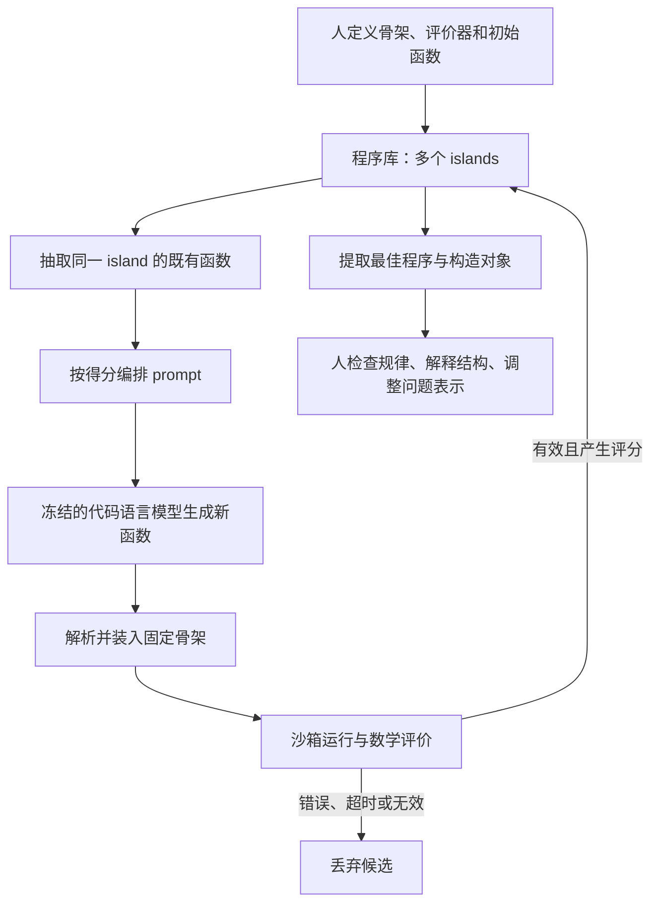

# FunSearch：让模型搜索构造方法，用程序评价候选

## 1. 它是什么，为什么入选

FunSearch 是围绕代码生成模型搭建的进化搜索系统。它主要搜索一个能构造好对象的程序，不负责把任意自然语言猜想写成证明。对本项目的价值，是展示一条与多 agent 对话不同的路线：如果候选对象可以严格、快速地检查，模型负责提出候选，程序负责给出反馈。

本篇对应 2023 年论文和公开实现，不把后来的 AlphaEvolve 功能倒填。具体数学案例见 [512-cap 深读](../dossiers/2023-funsearch-capset.md)。论文、代码和本地证书检查的来源定位见 [核查记录](../references/notes/2026-09-20-funsearch-source-audit.md)。

## 2. 输入输出：先把问题变成可执行接口

用户准备三个部分：评价入口、初始候选函数、可选的算法骨架。以 cap set 为例，固定骨架枚举向量，按优先级逐个尝试加入集合，同时排除会产生三点共线的候选。模型主要修改 `priority`，即“先试哪些向量”。输出是较好的优先级函数及其构造出的集合。

因此，人已经决定了问题表示、可变部分和评价标准；把这个过程描述成模型从零独立提出整个数学问题不准确。反过来，把它说成仅做语言润色也不准确：改变优先级会改变实际构造，产生此前未获得的有限对象。

## 3. 架构与一轮数据流

论文 §1、Methods A.1 与 Supplementary F 给出这条链。它不需要一个扮演数学裁判的 LLM 来决定某个有限集合是否合法。模型、评价器和程序库承担不同任务。

### 为什么保存多个岛群（islands）

只围绕当前第一名改写容易过早集中在一种结构上。程序库维护多个子群，各自演化；定期淘汰较弱的一半，再用保留群中的优秀函数重新初始化。这样既保存不同路线，也允许较好路线传播。

公开 `programs_database.py` 中，`Island` 按测试得分签名聚类，选择 prompt 时倾向较高分的簇，同簇中偏好较短程序；`reset_islands` 实现较弱子群重置。这是搜索多样性的工程机制，不是“不同 agent 必然独立思考”的数学保证。

### 提示词怎样构造

从同一 island 抽取通常两个程序，按得分排序，重命名为逐步改进的版本，再追加下一版本的空函数头，让模型续写。它利用既有候选作为上下文；不要求把全部历史输出或整份论文塞进每次调用。定位：Methods A.1、`Island._generate_prompt`。

### 候选怎样进入记忆

`Evaluator.analyse` 把生成函数装入模板，在指定输入上调用沙箱，收集返回的数值评分，再注册到程序库。公开代码还检查候选是否调用了不存在的旧函数版本。要注意：这层接线检查不替代用户评价函数的数学正确性；对多输入的处理也不能自动解释为“所有未见输入都成立”。

## 4. 模型、计算规模与版本差异

原实验使用代码模型 Codey（PaLM 2 系列），参数在推理阶段冻结；变化的是候选程序库。作者在补充材料比较了 StarCoder 和随机程序变异。不能将后来的大模型调用方式当成原实验配置。

| 项目 | 原文或公开代码记录 | 解释边界 |
|---|---|---|
| 每个 prompt 的既有函数 | 通常 2 个 | 不是所有任务必须为 2 |
| islands | 10 | 搜索子群，不是十个数学专家 |
| 重置周期 | 4 小时 | 淘汰较弱一半的搜索状态 |
| samplers | 15 | 生成进程，并非 15 个不同模型 |
| evaluators | Supplementary E.1 表 E.2 和代码默认 140；正文概述约 150 | 保留来源差别，不能混成精确运行账单 |
| 每次 prompt 的采样数 | 4 | 随机候选会有失败与重复 |
| 单候选默认超时 | 30 秒 | 任务有覆盖配置，不是整个研究停止时间 |

Supplementary A.5 对一个约两百万样本的 admissible-set 实验给出历史硬件与费用估算：15 个 StarCoder-15B/A100 实例、5 台 CPU 服务器、约两天、约 800–1400 美元。这是论文时期的特定实验估算，**不是 512-cap 的完整费用，也不是当前 API 价格**。

## 5. 实际可以怎样使用公开材料

这里区分三件事：

1. **学习算法**：阅读 `implementation/` 的调度、采样、评价和程序库代码。
2. **检查结果**：读取 `cap_set/` 的公开向量和 notebook，核查某个构造的性质；本项目只执行自己编写的数据检查脚本。
3. **重新发现**：必须另行提供模型、沙箱和分布式运行设施，并确定预算与停止方式。

代码入口为 `main(specification, inputs, config)`，规范要求各一个 `@funsearch.run` 和 `@funsearch.evolve` 函数。公开版 `LLM._draw_sample` 与 `Sandbox.run` 都抛出 `NotImplementedError`，因此直接下载仓库并不等于可以复跑原搜索。单线程入口中第一个 sampler 进入无限循环，配置多个 sampler 也不会自动获得并行。

停止条件也是使用者必须补充的工程接口：公开 `Sampler.sample` 是 `while True`，没有“发现最优解即证明完成”的通用条件。未来实验必须设运行时间、样本数或费用上限，但本批不实现或运行这些接口。

## 6. 验证器究竟保证什么

对有限集合，全部元素及所有相关组合可以精确检查，得到的是一个具体存在性证书。对一般启发式算法，在有限测试集上得分高通常只是实验表现，不能自动推出所有输入上的定理，更不能证明全局最优。

cap-set 骨架本身通过排除第三点保持合法性；独立检查最终集合仍有价值，因为骨架实现、候选运行、序列化和数据解释可能出错。证明某个集合有 512 点，与证明 512 是最大值，是不同命题。

公开结果程序、有限证书、完整搜索重现、组件效果因果解释也应分开。即使确定发现物有效，仍不能由此确定换一个模型或减少预算就能再次找到它。

## 7. 从中能学什么

| 实际做法 | 解决的问题 | 适用前提 | 风险与证据边界 |
|---|---|---|---|
| 固定合法构造骨架，只演化关键函数 | 减少模型重写已知正确逻辑 | 可把创造性集中到小接口 | 骨架可能排除好路线；论文有任务内消融，不是普遍最优设计 |
| 精确评价有限对象 | 让错误候选快速出局 | 检查比发现容易且可信 | 评价器漏条件会奖励伪进展 |
| 多群体保存与重置 | 减少陷入单一路线 | 有可比较的评分 | 高分未必意味着理论上有用；有预算成本 |
| 输出短程序并由人分析 | 从实例中理解结构 | 代码可读且存在可提炼规律 | 人的解释是独立贡献，不应归为模型自主证明 |

对动力系统研究，一个可能类比是搜索满足某些约束的多项式候选。但这是本项目的教学推测：若评价只检查网格点符号，就不能把“采样均为负”写成整个区域上的 Dulac 条件。只有符号推导、区间证书或覆盖论证等补足全域条件，才能进入证明。此处不建议直接迁移整个 FunSearch，也不评估任何本地研究系统。

## 8. 已知限制与下一阅读

模型和沙箱接口、原始分布式系统、逐次搜索日志及完整费用不能由公开库完整恢复。首批选择 FunSearch 而非更近的 AlphaEvolve 深读，是因为其骨架、具体构造、人工解释和有限验证可以在同一案例中讲清；不意味着 FunSearch 更强。

继续阅读：先 [案例](../dossiers/2023-funsearch-capset.md)，再读原论文 Figure 4、Supplementary E.2，最后看 `programs_database.py`。所有数值与版本定位汇总在 [来源记录](../references/notes/2026-09-20-funsearch-source-audit.md)。

## 集中复用入口

论文、固定代码版本、配置/工件入口及许可元数据见[来源与复用索引](../references/SOURCES.md)。
