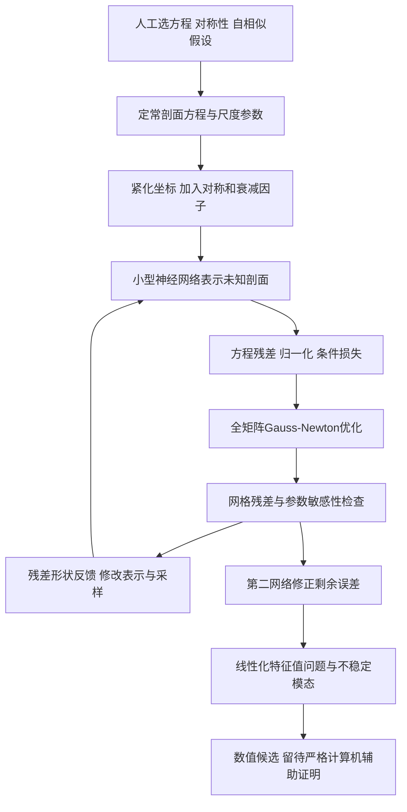

# 结构化PINN：把不稳定奇性变成可优化的定常问题

**◇ 动力系统相邻：PDE自相似解、谱不稳定性、有限时奇性。不是平面ODE。** 这是人主导的数学建模、神经函数逼近和高精度优化流程，不是LLM多代理harness。纳入它是为了展示AI4Math的另一种有价值路线：AI先产生精确数值候选，后续严格证明仍需另外完成。[案例](../dossiers/2025-pinn-unstable-singularities.md)

## 对象与架构

时间推进容易离开不稳定解，因而“模拟很久直到看见它”通常不合适。作者先做自相似变换，把寻求奇性改为同时寻找定常剖面与尺度参数，再用PINN直接表示剖面。[原论文Methods式(2)–(6)](https://arxiv.org/html/2509.14185v1)

## 关键设计：先减少模型必须学的东西

网络不直接输出任意函数。作者把无穷域映射到有界坐标，用乘性因子编码奇偶性、无穷远衰减和原点消失阶；通过归一化排除零函数及尺度任意性。比如涡量的奇对称由显式奇因子保证，网络只拟合剩余偶函数。[Methods “Solution Modeling and Equation Factorisation”、式(5)–(6)、式(13)–(14)](https://arxiv.org/html/2509.14185v1)

数学与计算双向反馈：初步结果提示比预设更高的消失阶，人再把它因式分解进表示。这里的架构调整是作者研究工作的一部分，不能把全过程写成模型自主选题、自主改理论。

## 优化、记忆、换路与停止

网络只有数千至数万参数，使全矩阵Gauss–Newton估计可行。用秩一估计及跨步平均近似曲率，配自动学习率/动量；这是数值优化器，不是语言模型“反思”。训练点既有固定区域采样，也有按残差加强的自适应采样；训练若频繁换点可能不收敛，原文采用较长间隔再重采样。[“High-precision training”及Methods “Second-order Optimizer”“Training Collocation Points”](https://arxiv.org/html/2509.14185v1)

第一网络收敛到精度平台后，第二网络拟合小误差，高频残差指导Fourier特征。状态包括网络参数、尺度值、残差场、采样权重和实验配置；没有公开事实DAG或证明接受机制。继续、改表示、增加训练阶段由误差形态与作者判断驱动；没有“达到某残差就自动证明”的停止条件。

原论文报告特定CCF比较中约50k步、约3 A100 GPU小时达到约$10^{-8}$残差；这个局部预算不代表整个研究成本，也不是一般PDE求解加速保证。[Fig.4及附近正文](https://arxiv.org/html/2509.14185v1)

## 验证范围与失败记录

验证包括稠密网格上的方程/导数残差、尺度参数扰动测试和线性化模态搜索。网格最大值不是连续全域的严格上界；残差小也不直接给真解存在性，需要误差估计、线性算子控制和非线性闭合等数学条件。寻找若干实非负特征值不证明已经找到全部复谱；原文谱分析限制在相同对称类。[Methods式(15)–(16)、“Spectrum of Linearization”](https://arxiv.org/html/2509.14185v1)

原论文明确第四个Boussinesq不稳定候选尚未可靠验证其尺度精度；补充资料脚注称将另发，本轮只取得v1正文。原实验的完整代码、参数包与补充资料未在本次已查原始集合找到。不要拿同标题第三方GitHub复刻当官方实现。

## 原版与后续版分开

2025-09的2509.14185v1是基础流程。2025-11的[2511.22819v1](https://arxiv.org/html/2511.22819v1)增加梯度归一化残差：尖梯度区域不再支配全部损失，使原点的尺度选择信号可见；作者报告提高高阶CCF/IPM精度，并发现第四个IPM不稳定候选及NLS结构。这些后续特性不能倒填到九月实验。

原论文提及使用开放库kfac-jax，但库公开并不意味着完整原始实验可复跑。[作者2026年讲座入口](https://nas.nasa.gov/pubs/ams/2026/03-05-26.html)也明确以数值构造及未来计算机辅助证明为主题。本轮未执行训练、谱计算、区间算术或证明重放。

## 方法卡与复用条件

|实际做法|解决问题|适用前提|风险|效果证据|迁移假设|
|---|---|---|---|---|---|
|自相似化后直接搜索剖面|时间推进排斥不稳定解|目标确在所选自相似类|漏掉其他类型解|多组数值剖面|对特定不稳定结构可能适用|
|将对称/衰减写进网络|减少必须学习的自由度|数学约束正确|错误结构预设排除真解|原文实验改善|类比ODE规范化有启发，不能直接套用|
|误差网络分阶段修正|单阶段精度平台|残差可定位且线性化有效|小残差被误认作证明|CCF数值残差下降|需独立误差理论才能转证书|

复用从原论文Methods和具体方程开始；需补取原始配置、精确边界/对称类、网格、权重、尺度归一化、停止标准及代码许可。当前可学习方法，不能承诺下载即复现。[来源记录](../references/notes/2026-09-20-dynamics-source-audit.md)
