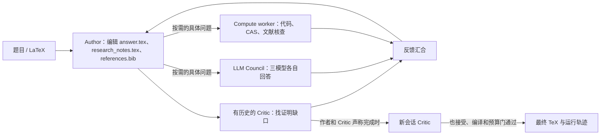

# ProofCouncil：作者、审稿人和辅助顾问的长程证明循环

## 它是什么，解决什么问题

ProofCouncil 是一个**围绕基础模型组织研究过程的 harness**，不是独立训练的数学模型，也不是 formal prover。输入是一道文字/LaTeX 数学题；作者模型反复编辑证明，审稿模型指出缺口；作者可按需请求其他模型和计算工作者。它面向已有明确问题与可写证明的任务，不能据此推断它能自主选题或形成理论。论文 [§2.1–2.2](https://arxiv.org/html/2607.09474) 和 [FirstProof 冻结提交](https://github.com/1stproof/batch-2/tree/274625a22e4748d5f9264ba3614353461520bd20/batch-2-submissions/improofbench) 是本档案的主依据。

图为论文 §2.1 和冻结配置的教学性概括；各辅助节点可跳过，绝非每轮固定调用。DAG 把有界循环展开，并根据作者的 `<council>`、`<compute_agent>` 请求有条件执行；相互独立的节点可并行。这里的“fresh”仅指不继承同一审稿对话历史，仍使用同系列 LLM，不能算数学独立证明。[论文 §2.2](https://arxiv.org/html/2607.09474)、[冻结配置](https://github.com/1stproof/batch-2/blob/274625a22e4748d5f9264ba3614353461520bd20/batch-2-submissions/improofbench/configs/workflows/author_critic.yaml)。

## 版本图：不能用新版解释旧成绩

| 用途与时间 | 可核查配置 | 适用范围 |
| --- | --- | --- |
| 2026 年 5 月 FirstProof 第二批提交 | [主办方冻结代码](https://github.com/1stproof/batch-2/tree/274625a22e4748d5f9264ba3614353461520bd20/batch-2-submissions/improofbench)：[author_critic_long.yaml](https://github.com/1stproof/batch-2/blob/274625a22e4748d5f9264ba3614353461520bd20/batch-2-submissions/improofbench/configs/workflows/author_critic_long.yaml)、[README/适配器说明](https://github.com/1stproof/batch-2/blob/274625a22e4748d5f9264ba3614353461520bd20/batch-2-submissions/improofbench/README.md) | 对 FirstProof P1–P10 的运行机制，可据此讨论；具体每题实际调用需逐题看日志。 |
| 2026-07-10 arXiv v1 | [论文 §2、§3、附录 C](https://arxiv.org/html/2607.09474) | 作者对结构、角色和结果的回顾；论文的后续功能不自动属于五月版本。 |
| 2026-09-10 公开仓库快照 `e7e1ea5` | [README](https://github.com/eth-sri/proof-council/blob/e7e1ea5236585e817a09de0e416a57c6c3013f77/README.md)、[firstproof_submission.yaml](https://github.com/eth-sri/proof-council/blob/e7e1ea5236585e817a09de0e416a57c6c3013f77/configs/workflows/firstproof_submission.yaml) | 当前可学习/配置的实现。此快照已采用 `gpt-5.6-sol` 等配置；**不是**五月挑战的模型配置。 |

论文贡献说明指出，David Holmes 是挑战结束后加入，参与 human-in-the-loop 节点、dashboard、resume 和成本核算等公开库改进。因此人类节点是**后来公开库的能力**，不可倒推为官方 FirstProof 逐题运行时的人工干预。[论文贡献说明](https://arxiv.org/html/2607.09474)。

## 角色、数据和研究路线

- **Author**：论文报告为 GPT-5.5-Pro、`xhigh`，可用内建代码执行与网页搜索。维护 `answer.tex`（拟交付证明）、`research_notes.tex`（思路、失败尝试、局部结果）、`references.bib`。每轮收到当前文件、审稿意见与上一轮辅助回答后修改，不是独立持久“事实图”。[论文 §2.1 Author](https://arxiv.org/html/2607.09474)。
- **Critic**：同为 GPT-5.5-Pro、`xhigh`，逐轮审查当前证明。通常保留对话上下文，每 3 轮重置；作者与有历史的 Critic 都认为完成时，再请求新会话 Critic。内部接受只是退出条件，不能充当 proof certificate。[论文 §2.1 Critic](https://arxiv.org/html/2607.09474)、[冻结配置](https://github.com/1stproof/batch-2/blob/274625a22e4748d5f9264ba3614353461520bd20/batch-2-submissions/improofbench/configs/workflows/author_critic.yaml)。
- **Council**：作者提出一个具体问题后，GPT-5.5-Pro、Claude Opus 4.7、Gemini 3.1 Pro 分别回答，彼此看不到其他 council 成员回答。回答进入作者下一轮，不能因“三模型一致”提升为证明。[论文 §2.1 LLM council](https://arxiv.org/html/2607.09474)。
- **Compute worker**：五月冻结配置为 Codex CLI 上 GPT-5.5 `xhigh`；论文说可用 SageMath、GAP、Singular、PARI/GP 等，也可检索文献、核查具体断言。其工作区可回传作者。CAS 算出例子、找到反例或程序返回成功，并不等于无限参数命题已证。[论文 §2.1 Compute node](https://arxiv.org/html/2607.09474)、[冻结配置](https://github.com/1stproof/batch-2/blob/274625a22e4748d5f9264ba3614353461520bd20/batch-2-submissions/improofbench/configs/workflows/author_critic_long.yaml)。

当作者在某一路线上修补局部缺口却没有实质进展时，系统**没有已公开的普适自动换路定理**。论文的事后日志分析反而观察到这种“局部极小值”停滞，提出多线程路线探索作为未实践的潜在改进。题目的明确停止条件是作者/审稿人共同通过、轮次上限、美元预算或时间上限。[论文 §2.1、§3.1 Postscreen audit、§4](https://arxiv.org/html/2607.09474)。

## 公开接口与运行边界

[当前公开 README](https://github.com/eth-sri/proof-council/blob/e7e1ea5236585e817a09de0e416a57c6c3013f77/README.md) 给出 `uv sync`、本地 Web app、CLI `scripts/run_workflow.py`、`--restart-from`、`configs/workflows/` YAML、`problems/` 输入和 `outputs/<run-id>/` 轨迹。FirstProof Docker 适配器读取 `/data/input/input.json` 的 `id`、`latex`，输出 `.tex`、`solutions.json`、`run_summary.json`、`token_usage.jsonl` 和详细 workflow traces。**这里只说明文档接口，本项目未安装、运行或接入。**

五月 [冻结 README](https://github.com/1stproof/batch-2/blob/274625a22e4748d5f9264ba3614353461520bd20/batch-2-submissions/improofbench/README.md) 记录每题上限 1000 美元、24 小时、12 页，初始按 5/10 轮分批，未完成可自适应续跑，最多 200 轮；这些是**上限和调度设置，不是每题实耗**。该版在 FirstProof 容器内将 compute subprocess 的 Codex 嵌套沙箱设为 `docker-bypass`；若未来实际试验，必须重新审计隔离和密钥权限，不能把这个比赛容器设置原样搬进日常主机。

## 验证强度与实际表现

主办方以盲审数学家评估 10 题。官方 [Second Batch 报告 §5](https://1stproof.org/assets/docs/report.pdf) 对系统 A 的 P1、P2、P3、P5、P7、P9 给出至多 minor revisions；P10 是有部分进展但需 major revisions，P4/P8 拒绝，P6 因 API 超时未交卷。论文记录总模型调用成本约 3186 美元，对有交卷的九题约 350 美元/题；同评估中单次 GPT-5.5-Pro 调用约 12 美元/题、九题中四题达到相应通过标准。这个对比不是随机受控消融，也不能证明某个节点单独带来了两题增益。[论文 §3.2](https://arxiv.org/html/2607.09474)。

作者指出 P8 的 Critic **误接纳**了含未被引用文献支持的关键断言的解答；P3 的 Critic 则在各阶段拒绝，而外部审稿给出 minor revisions。论文 §3.2.2 将 P3 列入值得注意的失败情形，但 P3 提交明示完整分类仍未解决：内部退出条件要求完整证明，外审可以认可有价值且正确的部分进展。这两个判准不完全相同，单凭决定相反不能认定 Critic 误判了同一个命题。P10 中有历史的 Critic 七次接纳中间版本，而 fresh Critic 都拒绝。这些记录提示须核对审查目标、阈值和问题语义。[论文 §3.2.2](https://arxiv.org/html/2607.09474)、[官方报告 §5](https://1stproof.org/assets/docs/report.pdf)。

## 可学习的做法及其前提

1. **把探索笔记与交付证明分开**：`research_notes.tex` 可保留失败和半成品，`answer.tex` 面向审稿。适合长问题；风险是笔记不构成经过证明的事实库。效果证据是公开结构和案例轨迹，尚无控制实验隔离此设计的贡献。
2. **仅对具体卡点调辅助资源**：作者通过结构化标签提问，可让 CAS/文献检查针对可证伪断言。适合有清晰子问题时；风险是辅助回答仍需回到主证明核查。作者报告 compute worker 在 P3/P4/P5/P8/P10 用得较多，归因仍限于日志观察。[论文 §3.2.2](https://arxiv.org/html/2607.09474)。
3. **有历史批评与新会话复核并行**：前者追踪上下文，后者减少同一历史的惯性；同模型 fresh review 仍可能误接纳；若与外部审稿意见不同，先核对两边评判的命题和完成标准，最终以原始论证与独立专家/形式化核验为准。

具体成果和局限见 [FirstProof P3 案例](../dossiers/2026-proof-council-firstproof.md)；本轮的来源、读取范围和未核查项见 [来源审计](../references/notes/2026-09-20-proof-council-source-audit.md)。

## 集中复用入口

论文、固定代码版本、配置/工件入口及许可元数据见[来源与复用索引](../references/SOURCES.md)。
