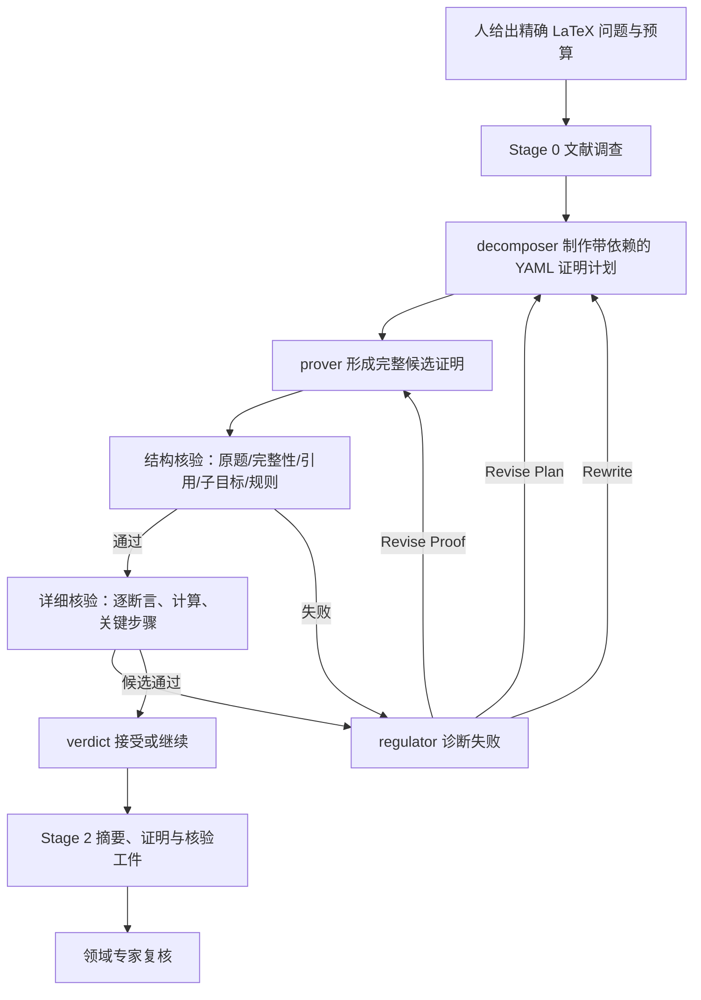

# QED：把证明计划、执行和检查分开的研究 harness

**推荐先读：[QED 全框架教程](qed/FRAMEWORK-GUIDE.md)**。本文保留系统概览及旧案例来源；教程贯通输入、角色、prompt、模型接口、三级反馈、文件状态、恢复和复用入口。

**类别与用途。** QED 是调用 Codex、Claude Code 或 Gemini CLI 的自然语言证明流程，不是独立基础模型，也没有把输出自动交给 Lean kernel。输入是 LaTeX 数学问题，输出包括文献调查、候选证明、LLM 核验报告及研究过程摘要。它适合能表述准确命题、需要较长多轮推导的任务；能否发现证明仍严重依赖所选模型、问题质量和人工终审。作者在 [系统论文 v4 §5](https://arxiv.org/html/2604.24021v4#S5) 报告：18 个专家提供的研究项目中，5 个项目得到作者和领域专家认可的结果。这是作者实验结论，不是本项目对五篇数学论文的独立验收。

**与用户研究方向的关系：重点相邻。** [对应案例](../dossiers/2026-qed-transport-diffusion.md)是二维环面上的输运–扩散 PDE 与流体混合估计。其证明包含剪切流、傅里叶模态、时间周期流和谱分析，值得动力系统方向读者重点学习；它不直接证明平面自治 ODE 的极限环数目、Hopf/BT 分岔或正规形结论。

## 版本和证据位置

|用途|原始来源、具体位置|版本与实际读取|缺口|
|---|---|---|---|
|架构|[系统论文 §3–5、Appendix C](https://arxiv.org/html/2604.24021v4)，[README 工作流](https://github.com/proofQED/QED/blob/121900964e6572aaf094412d434b5ac2a792a65f/README.md#how-it-works)|arXiv `2604.24021v4`，2026-06-26；README 固定于下述 commit|论文所述实验运行时的精确代码 commit 未绑定|
|当前源码|[pipeline.py](https://github.com/proofQED/QED/blob/121900964e6572aaf094412d434b5ac2a792a65f/code/pipeline.py)、[decomposition_prover.py](https://github.com/proofQED/QED/blob/121900964e6572aaf094412d434b5ac2a792a65f/code/decomposition_prover.py)、[model_runner.py](https://github.com/proofQED/QED/blob/121900964e6572aaf094412d434b5ac2a792a65f/code/model_runner.py)|`121900964e6572aaf094412d434b5ac2a792a65f`，commit 2026-08-16；本次只读|不能倒填解释 2026-04/05 的运行细节|
|当前配置与 prompts|[config.yaml](https://github.com/proofQED/QED/blob/121900964e6572aaf094412d434b5ac2a792a65f/config.yaml)、[分解 prompt](https://github.com/proofQED/QED/blob/121900964e6572aaf094412d434b5ac2a792a65f/prompts/decomposition-prover/decomposition.md)、[结构核验 prompt](https://github.com/proofQED/QED/blob/121900964e6572aaf094412d434b5ac2a792a65f/prompts/decomposition-prover/proof_verify_structural.md)|同一 commit；现示例为 `gpt-5.6-sol`、`xhigh`，只代表当前文件|并非 PDE 案例实际模型|
|PDE 案例|[数学论文 `2605.20623v1` §2–5](https://arxiv.org/html/2605.20623v1)、[旧运行结果目录](https://github.com/proofQED/QED/tree/03faa8238aef4710084b117657ec9f0f7e80fe57/proved_statements/analysis-Apr-24-2026)、[后续结果说明](https://github.com/proofQED/QED/blob/121900964e6572aaf094412d434b5ac2a792a65f/proved_statements/analysis-May-19-2026/README.md)|简单模式旧证明工件最早所见 commit `03faa8238aef4710084b117657ec9f0f7e80fe57`，2026-04-24；数学论文 v1，2026-05-20|未取得完整机器运行日志和每轮 verifier 报告|

更多逐项入口见[本批来源收据](../references/notes/2026-09-20-qed-expansion.md)。系统论文与案例论文的日期、模型配置必须分开读。尤其当前 `config.yaml` 只支持 decomposition，系统论文 §4 还介绍 simple mode，且 PDE 案例前两道题按 §5.1 使用 GPT-5.4 simple mode；这不是可互换的同一版本。

**来源冲突提示。** 旧分析目录 README 写 GPT-5.4 Codex prover / Gemini 3.1 Pro verifier；系统论文 v4 §5.1 则把前两题写成 “all agents” Codex GPT-5.4。没有历史配置和调用日志，核验模型不能择一认定。

## 架构：工作流究竟做什么

这幅图表示 [系统论文 §4.1–4.3](https://arxiv.org/html/2604.24021v4#S4) 的*流程设计*；不是某次 PDE 运行的完整逐轮日志。Stage 0 先调查文献；simple mode 每轮可由多个模型并行写整篇证明，再由结构和细节核验、selector 与 verdict 处理。[§4.1](https://arxiv.org/html/2604.24021v4#S4.SS1) 称生成者与核验者是无共享上下文的独立调用，但可使用同一底层模型，不能因此称作独立数学验证。decomposition mode 先生成 YAML 的精确中间命题、依赖、难度与关键步骤，再让单一 prover 依计划写完整证明；计划不是已经证明的引理。[§4.2](https://arxiv.org/html/2604.24021v4#S4.SS2) 和固定版 `decomposition_prover.py` 中的 `DecompositionState` 记录 `attempt / revision / proof` 层级和失败历史。

每份候选必须标出 `<key-original-step>`：把最难、最新的步骤展开展示；结构核验还查有没有漏标或把常规步骤假装承重创新。[§4.3–4.4](https://arxiv.org/html/2604.24021v4#S4.SS3) 同时要求逐字对照原题、精确定位引用定理及其假设、检查子目标树。上述“查”是 LLM 工序承诺，实际可靠性仍须看报告和人工核查。

## 状态、换路与停止

当前源码 `decomposition_prover.py` 的 `DecompositionState` 将每个 decomposition attempt 下的 plan revision、proof attempt、verification reports 和 regulator decision 分目录保存；`STATUS.md`/`log.txt` 用于过程导航。[论文 §4.2](https://arxiv.org/html/2604.24021v4#S4.SS2) 的三种反馈有不同作用：证明执行疏漏→`REVISE_PROOF`；计划结构有缺口→`REVISE_PLAN`；根本路线错误→`REWRITE`。因此它保留试错层级，不是只有最终答案的聊天记录。当前代码的 `parse_regulator_decision` 若格式无法识别，默认 `REVISE_PROOF`；这是源码里的保守重试策略，不能解释任一历史案例具体失败。

论文 §4.7 说可以从输出目录扫描恢复中断流程；当前配置的 `max_proof_attempts: 8`、`max_revisions: 4`、`max_decompositions: 4` 是**2026-08-16 快照**，与源码内 `DEFAULT_CONFIG` 的 3/2/3 也不同。实际生效值需查该次运行的配置和日志；本批没有把这些数当作 PDE 历史限额。系统论文 Appendix C 报告 PDE 内部 P1/P2 simple mode 各 4 轮，其余 P3–P12 的 attempt/revision/proof 编号，但不构成全量日志公开。

## 验证器的能力边界

|层|按论文要求检查|仍可能遗漏|
|---|---|---|
|结构阶段 1–5|原题量词/范围、完成度、引用与假设、子目标树、人给规则|引用网络漏查、错误的数学判断、同模型偏差|
|详细阶段 6|逐断言依据、依赖、计算、关键步骤详尽性|长推导中的隐含条件、分析定理的函数空间适用性|
|verdict|读所选证明的核验报告，决定结束/继续|其本身不产生独立证明|
|专家|对成果与意义的人工判断|不能由“专家确认”反推整个搜索流程已复现|

[系统论文 §5.2](https://arxiv.org/html/2604.24021v4#S5.SS2) 报告在使用 Codex GPT-5.5 verifier 的子集中，214 个候选、17 个机器接受，之后对应专家均接受，观察到的假阳性数为零。这只是所观察集合的计数，不能推成零假阳性概率，也不能自动外推到 GPT-5.4/Gemini 的先前 PDE simple-mode 运行。数学论文 [§5](https://arxiv.org/html/2605.20623v1#S5) 另报告该 PDE 工作 66 个候选、14 个机器接受及人工确认；两个统计口径不能相加或互相替代。本项目没有独立逐行验收 PDE 全文。

## 公开复用入口与权限

1. [官方仓库固定 commit](https://github.com/proofQED/QED/tree/121900964e6572aaf094412d434b5ac2a792a65f) → [README Getting Started](https://github.com/proofQED/QED/blob/121900964e6572aaf094412d434b5ac2a792a65f/README.md#getting-started) → [config.yaml](https://github.com/proofQED/QED/blob/121900964e6572aaf094412d434b5ac2a792a65f/config.yaml) → `problem/problem.tex` → `run.sh`/`code/pipeline.py` → 输出目录的证明与报告。要学习机制，可先只读 [prompts](https://github.com/proofQED/QED/tree/121900964e6572aaf094412d434b5ac2a792a65f/prompts) 和 `code/decomposition_prover.py`。
2. README 所述运行前提是 Python 3.11+、PyYAML、至少一个可用的模型 CLI；`run.sh` 将 conda 环境名称写为 `agent`。当前 `config.yaml` 的 Claude `permission_mode: bypassPermissions`、Gemini `approval_mode: yolo` 是高权限设置；复用前需按所用环境单独审权限、账号和成本，不能照搬示例配置到现有研究仓库。本批只读，没有安装或运行 QED。
3. [MIT LICENSE](https://github.com/proofQED/QED/blob/121900964e6572aaf094412d434b5ac2a792a65f/LICENSE) 是该固定源码仓库可见的许可入口；论文和模型服务各有独立条款。源码公开并不包含历史 API 调用环境、所有模型权重或全部运行轨迹。

## 方法卡与学习顺序

|实际做法|所解困难|适用前提|风险与效果证据|仍待检验的迁移假设|
|---|---|---|---|---|
|精确题面比对 + 关键步骤标签|模型悄悄改题或跳过难点|原题可写成可比对命题|§3 故障分析、§4 设计；历史每次漏检率未知|用于含参数分支的定理能否减少漏支|
|计划 DAG 与三级重试|长程路线反复漂移|中间命题和依赖可显式化|源码及 Appendix C 有局部轮次；无受控全量消融|能否区分“代数执行错”和“定理路线错”|
|结构先于细节的多阶段核验|一次性长篇审读失焦|有资源承担多轮模型调用|论文观察计数；LLM 不能作为证明核|何时最值得追加独立专家或形式工具|

建议先读[全框架教程](qed/FRAMEWORK-GUIDE.md)，再按问题查官方配置和 prompts。PDE 案例是可选背景，不要求先读其数学证明。后续更新优先补充机制版本、公开日志、成本和复用接口；数学原文审查仅在另行明确委托时进行。
