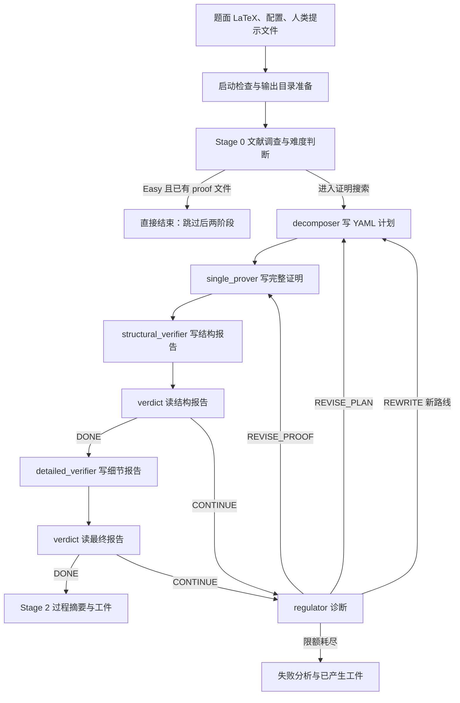

# QED 全框架教程：一个数学任务怎样经过计划、证明、反馈与恢复

更新：2026-09-20。阅读目标是理解和以后复用 harness；数学成果只作背景，不在这里审查其证明。本教程说明固定公开版本，未安装或运行 QED。“全框架”指覆盖外层程序的完整任务生命周期，不指公开了模型内部或历史实验全部细节。

## 1. 先理解它替研究者组织了什么

把一道准确的数学题交给模型，得到一份长答案，只完成了候选生成。QED 在这之外安排文献调查、路线规划、整篇证明、两层检查、失败诊断和重试，并把过程落到文件。人负责给定问题和使用成果；程序决定下一次调用哪个角色；模型负责具体判断和写作。

这里的 agent 主要是“带特定提示词、输入文件和输出要求的一次模型 CLI 调用”。同一模型可以承担多个角色，不能按角色数理解为多个独立专家。QED 的 decomposition 模式先拆解证明计划，再由一个 prover 写完整证明；它并不为每个引理自动创建并行研究团队。

选择它作第一篇教程，是因为入口、配置、prompts 和控制程序公开且可以贯通解释；不是认定它在所有数学任务上最好。其代表工作涉及输运–扩散 PDE 的下界，属于与你的方向相邻的分析问题；成果背景见[系统概览](../qed.md)，无需先读生成的数学论文。

## 2. 固定版本和来源地图

本文所有代码链接固定到 `proofQED/QED@121900964e6572aaf094412d434b5ac2a792a65f`。访问日为2026-09-20，仓库该快照日期为2026-08-16。下文的默认参数仅指这个快照，不代表今天所有模型服务都仍支持这些参数。

|要理解的部分|官方固定来源|先看什么|
|---|---|---|
|整体使用|[README][readme]、[run.sh][run]|输入路径、启动动作、输出目录|
|阶段调度|[pipeline.py][pipeline]|`main`、`run_literature_survey`|
|搜索与状态|[decomposition_prover.py][decomp]|`DecompositionState`、`run_decomposition_prover`、`detect_decomposition_resume`|
|模型连接|[model_runner.py][runner]|`resolve_agent_provider_config`、`run_model_for_agent` 和三种 CLI wrapper|
|参数|[config.yaml][config]|provider 全局值、角色覆盖、三个限额|
|模型工作指令|[prompts 目录][prompts]|任务要求、路径占位符、返回格式|

逐函数行号、实际读取范围及限制另见[控制流定位](../../references/notes/2026-09-20-qed-control-map.md)和[接口定位](../../references/notes/2026-09-20-qed-interface-map.md)。这两份是查来源的索引，正文负责解释各部分为什么连起来。

历史系统论文还介绍 simple mode，历史 PDE 工作使用过其他模型和配置。当前入口只支持 decomposition；不能用本教程的模型、限额或每条代码路径倒推旧成果的产生过程。历史绑定与冲突见[旧来源收据](../../references/notes/2026-09-20-qed-expansion.md)。

## 3. 一张完整流程图



图中 DONE 是模型报告经程序解释后的停止信号，不是数学证明核的结论。Easy 分支尤其值得注意：代码看到 Stage 0 生成的证明文件后即可提前结束，不能把它描述成所有输出都经过后面的双层 verifier。来源：[pipeline Stage 0/1/2][pipeline]，尤其 L785–855。

## 4. 人给什么，程序保存什么

默认题面在 `problem/problem.tex`。人应写清数学对象、假设、参数范围和目标；这是避免解错题的输入要求，不要求在交给系统前先证明题目。`human_help/` 可提供建议、已有引理或限制；它是指导材料，内容不因进入目录就被认定为真。

`run.sh` 接受题面、输出目录、配置三个位置参数。它先运行 smoke test，再把仓库级 `human_help/*` 用不覆盖已有文件的方式复制到输出目录。随后启动 Python pipeline。直接调用 Python 会绕过这部分 shell 准备，不是完全等效入口。[来源：run.sh L7–36][run]。

pipeline 保存 `problem.tex` 与 `config_used.yaml`。前者仅在不存在时复制，后者每次写入；所以不能修改题面或配置后仍把旧目录当成一个自动版本隔离的实验。为新题面另建输出目录，是依据代码行为给出的复用建议，不是它已有的强制机制。[来源：pipeline L663–717][pipeline]。

## 5. 角色分工：谁看什么，谁交什么

|角色|主要输入|产出与下一步|
|---|---|---|
|literature_survey|题面、输出路径|难度评估；一般写相关工作，Easy 可直接写证明|
|decomposer|题面、相关工作、人类帮助、已有路线记录；修订时还有旧证明与反馈|带 STEP 标识和依赖的 YAML 计划|
|single_prover|计划、题面、相关工作、人类帮助；重试时带旧证明和报告|完整候选证明，不是只解其中一个子目标|
|structural_verifier|题面、证明、计划、规则|题面一致性、引用、计划覆盖与关键步骤等结构报告|
|detailed_verifier|题面、证明、计划、结构报告|逐步推导与依赖组装的细节报告|
|verdict|结构或最终核验报告|要求返回 DONE 或 CONTINUE，供程序分支|
|regulator|失败报告、当前计划与证明、历史、剩余层级信息|改证明、改计划或换路线的决定及指导|
|proof_summary|输出目录中的生成文件|研究过程、路线和资源摘要|

角色依据：[活跃 prompt 模板][prompts]、[控制程序][decomp]。新调用可通过文件看见指定的旧结果；并非承接所有角色的完整对话历史，也不能仅因调用分开就称判断彼此独立。

## 6. prompt 怎样成为可执行接口

模板不只是“请严谨证明”一句话。它包含任务身份、操作约束、要读的路径、输出位置和格式。Python 用本轮的题面、计划、报告等路径替换占位符，再调用模型 CLI；CLI 中的模型读取文件并写工件。因此上下文有两层：提示词交代任务，工作目录和路径提供可读取材料。

例如分解模板要求输出 YAML，记录步骤、依赖及关键节点；prover 模板要求沿 STEP 标识写整篇证明，精确保留题面，给外部结果加 `<cite>`，给原创承重步骤加 `<key-original-step>`。这些标签使后续检查能定位对象，不会自动保证引用真实或关键步骤正确。

结构报告与细节报告要求给出 PASS/FAIL；verdict 模板要求只回 DONE/CONTINUE。这里必须区分“模板要求”和“代码解析”：当前 `run_verdict` 仅检查响应中是否包含 `DONE`，不是严格校验整个响应等于一个枚举。计划 YAML 无法解析时会报错；部分角色未写目标文件但返回了可用文本时，调用方会用响应补写。这些接口约定是学习其自动串联机制的关键。[来源：decomposition_prover L757–978、L1249–1322][decomp]。

## 7. 研究路径如何展开

一般路径从文献调查开始：模型写研究背景与难度判断，再进入分解。decomposer 把主目标转换为一组有依赖的中间任务，指出重点；prover 尝试把它们组织成一份完整证明。计划中的节点此时仍是待解决任务，不是已经确认的知识库条目。

结构检查先问“是不是解决原问题、有没有漏掉必要部分、引用与关键步骤是否交代”；只有其 verdict 给 DONE，才进入详细检查。详细检查再读推导和依赖是否接得起来。这样的组织把两类阅读任务拆开；是否实际降低漏检率，还需要实验支持，不能由架构本身推出。

失败后，不让证明者只凭一句“再试一次”重复写。regulator 读取失败处及历史，输出下一步的修改层级。这是 QED 相比一次长对话最值得学的部分：它把研究失败分为不同尺度，并让文件结构保留这个尺度。

## 8. 三层重试不是三个同义词

|层级|目录编号|保持什么，改变什么|
|---|---|---|
|证明重试|`proof_K`|保留计划，修补执行或推导|
|计划修订|`revision_M`|保留大路线，调整子目标和依赖|
|路线重写|`attempt_N`|重新组织整体方案，并参考失败路线历史|

`REVISE_PROOF` 进入下一份 proof；`REVISE_PLAN` 生成新 revision；`REWRITE` 开新 attempt。若某层配额耗尽，程序也会推进到外层，不是只有 regulator 能触发变化。无法识别 regulator 决策时默认尝试修证明。[来源：解析函数 L261–277、主循环 L1640–1980][decomp]。

当前配置允许每计划最多8次证明、每路线最多4次修订、最多4条路线；代码缺省回退是3/2/3。README 还有不同默认注释，所以应以运行实际配置为准。三个数不是模型调用总数：文献调查、分解、多个核验、verdict、regulator 和摘要也消耗调用。[来源：config L94–123][config]。

## 9. 一个贯穿全程的教学例子

**以下是帮助理解控制流的虚构例子，不是 QED 真实日志，也不声称已经取得新的 ODE 结果。** 设人给的问题是“在参数集合 I 上证明某平面系统满足性质 P”，并在题面中准确说明 I 和 P。

1. survey 查找相关方法，写背景；假设它判为 Medium，进入分解。
2. decomposer 提出 STEP-1 建立有界区域、STEP-2 分析区域中的对象、STEP-3 汇总为 P。这个方案只是候选路线。
3. prover 写 `attempt_1/revision_1/proof_1/proof.md`。
4. structural verifier 指出证明没有覆盖 I 的边界参数；verdict 给 CONTINUE，尚不做详细检查。
5. regulator 若认为原计划已要求处理边界、只是执行遗漏，给 REVISE_PROOF；若计划必须新增一个边界引理，则给 REVISE_PLAN。
6. 新证明通过结构检查后进入详细检查。若关键引理不成立且破坏整个路线，regulator 可以 REWRITE。
7. 某候选经模型流程接受，则整理工件；若各层限额用完，则留下失败分析。人据此决定如何使用结果，而不是把终端上的 PASS 当作定理成立。

这个例子教的是“反馈如何改变下一次任务”，不是提供关于 P 的数学策略。它也说明模型必须能诊断失败原因，否则多层目录仍可能只存下重复失败。

## 10. 长期记忆与文件：哪些东西会留下

下面是主要文件的示意；条件未触发时相应文件可以不存在：

```text
output/
  problem.tex
  config_used.yaml
  human_help/
  related_info/
    difficulty_evaluation.md
    related_work.md
  proof.md
  proof_effort_summary.md
  TOKEN_USAGE.md
  token_usage.json
  AUTO_RUN_STATUS.md
  AUTO_RUN_LOG.txt
  decomposition/
    STATUS.md
    log.txt
    plan_history.md
    failure_analysis.md
    attempt_1/
      revision_1/
        decomposition.yaml
        decomposer_response.md
        proof_1/
          proof.md
          prover_response.md
          structural_verification.md
          detailed_verification.md
          regulator_decision.md
```

这一版主要用文件和编号目录持久化状态，不应介绍成向量数据库或已验证数学事实图。`plan_history.md` 给未来分解提供失败路线背景；regulator prompt 要求在特定决策后追加历史，不等于程序能确保记录完整、总结正确。[来源：DecompositionState 与 regulator 装配][decomp]。

顶层 `proof.md` 会被新的候选覆盖，因此它方便读最新版本，却不代表“已通过的最终证明”。历史证明应沿各层目录找。状态页是人类导航，恢复逻辑主要扫描工件，不把状态页当完整事务日志。

## 11. 模型、工具与配置怎样接起来

`config.yaml` 为 Claude、Codex、Gemini 定义全局设置；每个角色指定 provider，并可覆盖相应模型参数。例如某角色只写 `provider: codex`，就继承全局 Codex 的模型和 reasoning effort。该快照示例的流程角色均选 Codex，默认是 `gpt-5.6-sol/xhigh`；多角色不意味着默认多模型。[来源：配置与 resolve_agent_provider_config][config]。

`model_runner.py` 把统一调用翻译成三种外部 CLI 命令：Claude 的 JSON 输出、Codex 的 JSONL 事件、Gemini 的 JSON 输出各有解析规则。wrapper 提取回复和 token 记录，返回文字给控制程序。Codex 命令带搜索选项；实际读取文件、网络搜索、shell 等能力还依赖 CLI 环境及其权限，并非 QED 另写了一套数学工具内核。[来源：model_runner L80–587][runner]。

这里没有默认把每次证明接到 Lean 或 Mathematica 的独立验收接口。模型可能使用 CLI 可用工具，但“工具可用”“该次实际调用”“工具证明了结论”必须分别描述。不能从通用 shell 能力推断历史运行做过 CAS 检查。

## 12. 预算、超时、异常与停止

数学搜索限额限制的是上述三层尝试，不是美元上限或总 token 上限。token 文件记录用量；本文没有取得可复算的统一价格和完整历史调用，因此不给一个虚构总成本。

模型通信失败与数学失败不同。wrapper 对 Claude 设置最多3次调用尝试；退避数组虽列30/60/120秒，但不能把它描述成初次之外必有3次重试。Codex 非零退出却已有非空回复时可能只告警继续；Gemini 非零退出通常抛错。上层应结合日志辨别是模型运行失败、格式失败还是证明检查未通过。[来源：model_runner L132–242、L361–407、L547–587][runner]。

所读三个 wrapper 的 `subprocess.run` 没有设置 `timeout`，所以三层研究限额不保证每个 CLI 调用在固定时间内结束；外部 CLI 或运行环境可能另有行为，本文未验证。成功停止、限额用尽、异常中断是不同终点。用尽配额时会调用最终失败分析，而不是继续无限换路线。[来源：model_runner 与主循环末尾][runner]。

## 13. 中断后怎样恢复，有什么边界

README 建议以相同参数重跑。程序扫描最高编号的 attempt/revision/proof，判断缺的是计划、证明、结构报告、细节报告还是 regulator，再选择恢复点。已有非空 survey 或 summary 可能被跳过。这能避免每次从头付费，但不是完整实验环境快照。

两处实现差异直接影响复用理解：正常运行由 verdict 模型返回 DONE 决定前进，恢复时却检查报告字符串 `OVERALL VERDICT: PASS`；已有失败报告及 regulator 文件时，恢复扫描会推进下一 proof，而未解析其中是否要求改计划或换路线。不能保证任何中断时刻恢复都等价于连续运行。[来源：detect_decomposition_resume L521–682][decomp]。

因此，恢复前核对题面、实际配置、最后一份报告和 regulator 决策，是本教程给出的操作建议。程序没有为这些输入建立完整哈希绑定；重用旧目录不应被当作自动保证版本一致。

## 14. 读输出时最容易误解的一处

pipeline 在 Stage 1 后用顶层 `proof.md` 是否存在且非空判断成功，并据此向摘要传入 PASS 信息；但候选生成时就会覆盖该文件。因此即使搜索最终失败，也可能留下非空候选并出现乐观的上层成功描述。这个判断来自静态源码，未在本机运行复现。[来源：pipeline L820–855][pipeline]、[save_proof L380–386][decomp]。

学习与将来试用时，应同时查看最后一次核验、决策、失败分析和分解状态，不能只看文件名或终端横幅。这里指出它，是为了准确解释结束接口；本轮没有修复外部仓库，也没有扩展成软件全面审计。

## 15. 公开使用路径与复用准备

官方 shell 入口的形态如下，**只作接口说明，本项目未执行**：

```bash
bash run.sh path/to/problem.tex path/to/output path/to/config.yaml
```

README 写 Python 3.11+、PyYAML 和模型 CLI；shell 脚本固定使用名为 `agent` 的 conda 环境，pipeline 还检查 `claude` 与 `python3`。所以“配置只使用 Codex”不代表可以忽略所有启动依赖。[来源：README][readme]、[pipeline L80–96][pipeline]。

将来复用的具体准备顺序是：取得固定源码 → 读配置和 prompt → 准备准确题面与独立输出目录 → 按隔离环境设置依赖、认证与可写范围 → 做启动检查 → 运行后读分层工件。源码中 Claude/Codex 命令有跳过权限或沙箱限制的参数，Gemini 示例是 `yolo`；这解释了为什么当前不能把官方命令直接当成可在现有研究目录安全照搬的配置。隔离试用需另行任务，本轮仅学习。

源码许可入口为[MIT LICENSE][license]。可复用的是外层程序、模板、配置结构和公开工件；模型权重、账号额度、完整历史日志、人的全部干预不随源码一起提供。当前服务兼容性仍需实际试用时核对。

## 16. 哪些设计值得学习，哪些效果尚不能下结论

|来源中的实际做法|解决的问题与前提|风险和效果证据|尚待检验的迁移设想|
|---|---|---|---|
|题面、计划、报告分文件|跨调用保留研究对象，前提是输入准确|代码支持文件交接；文件存在不保证被正确理解|你的含参数问题能否因此减少目标漂移|
|STEP 与依赖计划|使长证明有可讨论结构，前提是能拆出有效中间目标|prompt 与 YAML 接口公开；计划本身可能错误|是否有助于把正规形计算与定理使用分开|
|结构检查先于细节|先定位漏题和漏步，避免一次阅读承担所有任务|调用顺序有源码；本文未做效果实验|是否能更早发现遗漏参数边界|
|证明/计划/路线三级反馈|区分局部失误与战略失败|代码可追踪层级；诊断仍靠模型，恢复有局限|是否能减少同一路线的无效重试|
|历史工件与 plan history|保留失败供后续读取|目录机制可见；没有保证完整的自动数学知识维护|是否有助于多日研究交接|

这些是值得理解的机制，不是已证明能提高你的研究效率的结论。公开成果提供研究背景；仅凭个案成功，无法分离基础模型、预算、选题、人类介入和 harness 各自贡献。现在最合适的学习任务是把上述输入输出关系读懂，再选另一系统比较它如何解决同一困难。

## 17. 读完以后如何继续

第一遍按正文1–10节读完整循环；第二遍跟着配置、一个 prover prompt 和 regulator prompt 看具体要求；第三遍只沿一个失败分支查源码。需要精确行号时用两份定位笔记，不必重读所有文件。其余系统可从[候选目录](../../CANDIDATES.md)和[方法比较](../../guides/COMPARISON.md)进入。

本篇完成的是公开固定版本的框架介绍。数学筛选仅使用现有成果背景，没有新读生成数学论文、重算公式或重放证明；未来也不把这些工作作为每篇 harness 介绍的默认门槛。

[readme]: https://github.com/proofQED/QED/blob/121900964e6572aaf094412d434b5ac2a792a65f/README.md
[run]: https://github.com/proofQED/QED/blob/121900964e6572aaf094412d434b5ac2a792a65f/run.sh
[pipeline]: https://github.com/proofQED/QED/blob/121900964e6572aaf094412d434b5ac2a792a65f/code/pipeline.py
[decomp]: https://github.com/proofQED/QED/blob/121900964e6572aaf094412d434b5ac2a792a65f/code/decomposition_prover.py
[runner]: https://github.com/proofQED/QED/blob/121900964e6572aaf094412d434b5ac2a792a65f/code/model_runner.py
[config]: https://github.com/proofQED/QED/blob/121900964e6572aaf094412d434b5ac2a792a65f/config.yaml
[prompts]: https://github.com/proofQED/QED/tree/121900964e6572aaf094412d434b5ac2a792a65f/prompts
[license]: https://github.com/proofQED/QED/blob/121900964e6572aaf094412d434b5ac2a792a65f/LICENSE
