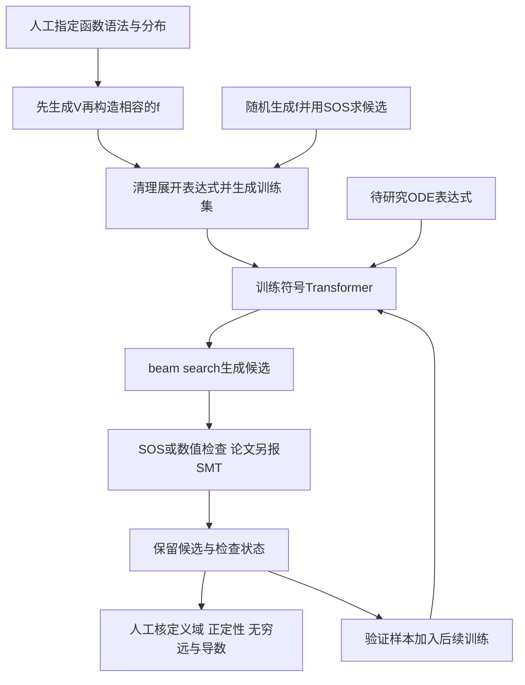

# 符号Lyapunov发现：学习候选公式，再分别核验

**★ 直接相关：平面ODE、平衡点稳定性、全局分析。** 这是专用模型及数据生成—搜索—验证流水线，不是通用聊天模型的多代理harness。价值在于给出可读表达式，不能根据标题理解成一般稳定性判定问题已解决。[具体数学案例](../dossiers/2024-symbolic-lyapunov-planar.md)

## 输入、输出与核心困难

输入为自治系统$\dot x=f(x)$的符号表达式，默认平衡点在原点；输出候选$V(x)$。同题有多个正确函数，不能只比对参考字符串。论文定义包括正定性、沿轨线不增与径向无界；不增不一定推出渐近稳定。[论文§2，定义2.2、式(3)](https://arxiv.org/html/2410.08304v1#S2)

表达式被编码为前缀树序列，序列到序列Transformer预测函数，再用beam search提出候选。[§3](https://arxiv.org/html/2410.08304v1#S3)

## 反向生成数据为什么有用

随机ODE可能不稳定，也可能稳定但难以取得证书。作者先生成具有适当正性和增长结构的函数，再构造使其沿流不增的向量场；展开、合并及多样化构造，减少模型直接读出答案。正向数据则用SOS筛选可解问题。[§4.1–4.3、附录B](https://arxiv.org/html/2410.08304v1#S4)

这不消除分布偏差：特定证书反推的系统不能代表所有稳定系统。作者以其他生成分布测试泛化，再用expert iteration加入已找到的证书；更多数据不总提高所有基准。[§5.5与§6](https://arxiv.org/html/2410.08304v1#S5.SS5)

## 模型、状态与停止

论文§3主实验报告8层、10个注意力头、嵌入维640，8张32GB V100，3–4个epoch，约12–15小时/GPU；当前公开`train.json`示例却为6层encoder/decoder、batch 4，不是论文原运行快照。常用beam50，F.1案例用100；beam宽度不是代理数。

持久状态是样本、权重、评测结果和日志，没有公开的数学事实依赖撤销图。`check_lyap_validity`分别返回语法错误、优化失败、超时等状态；论文计分把无答复算失败，不能据此证明证书不存在。训练有验证指标停止配置，没有数学意义上的搜索穷尽判据。[固定配置](https://github.com/facebookresearch/Lyapunov/blob/ce72b4ccbbe3fc00ee869c88b64a293381965a0b/train.json)

## 验证器的实际边界

|来源|实际检查|不能直接推出|
|---|---|---|
|论文SOS方案|正性与导数符号的充分条件|找不到SOS不等于没有其他证书；浮点SDP还需精确证书或误差处理|
|公开`test_V_positive`|无额外定义域时仍在每坐标`[-10,10]`上用shgo按容差判符号|全空间不等式、严格正定、径向无界或形式证明|
|论文dReal实验|作者描述为选定球内的SMT检查|全空间性质；超时不是反证|
|代码参考答案快捷路径|候选与参考相同即判有效|独立重验证，此路径信任原标签|

定位：[ode.py L127–201](https://github.com/facebookresearch/Lyapunov/blob/ce72b4ccbbe3fc00ee869c88b64a293381965a0b/src/envs/ode.py#L127-L201)、[L2146–2293](https://github.com/facebookresearch/Lyapunov/blob/ce72b4ccbbe3fc00ee869c88b64a293381965a0b/src/envs/ode.py#L2146-L2293)。这条主路径没有完整径向无界检查，本次也未取得论文SMT实验的完整执行接口。因此候选、有限范围数值通过、严格全局证书必须分层记录。

## 公开复用入口

- [固定官方仓库](https://github.com/facebookresearch/Lyapunov/tree/ce72b4ccbbe3fc00ee869c88b64a293381965a0b)：README给生成、清洗、训练流程；`train.py`入口，`create_dataset.py`整理数据，`src/model/transformer.py`实现模型，`src/evaluator.py`评估候选。
- `generate_bwd_poly.json`、`generate_bwd_nonpoly.json`、`generate_fwd_poly.json`区分数据路线；`src/envs/ode.py`的`gen_lyap_fun`、`gen_lyap_system`、`gen_lyapunov`连接函数与向量场生成。
- README列Python3.9/3.10环境，说明设计环境为Linux/Mac，Windows的dReal可能有困难。本轮未安装或运行。
- 仓库页面显示2026-04-02归档；[LICENSE](https://github.com/facebookresearch/Lyapunov/blob/ce72b4ccbbe3fc00ee869c88b64a293381965a0b/LICENSE)为CC BY-NC 4.0。原实验权重与逐案例运行绑定未在已查集合确认。

## 方法卡

|实际做法|解决问题|前提|风险|效果证据|迁移推测|
|---|---|---|---|---|---|
|先造证书再造系统|取得带答案训练集|能构造相容向量场|生成分布偏差|跨分布实验|特定ODE族可尝试，但需另做评估|
|生成符号函数|允许后续数学检查|语法覆盖所需函数|语法太窄漏解|F.1找回对数型函数|可作为稳定性候选器|
|beam加外部检查|同题尝试多个证书|验证条件明确|有限域/容差过度接受|代码可定位|保留未知与超时，另做全局核验|

阅读深度为章节介绍与有界源码核查，有限二维例子的初等核验不覆盖整套实验。[来源收据](../references/notes/2026-09-20-dynamics-source-audit.md)

## 收录复评：保留方法价值，不以简单例子代表论文（2026-09-20）

本项保留为专门的证书发现方法。新增核对[NeurIPS 2024正式入口](https://proceedings.neurips.cc/paper_files/paper/2024/hash/aa280e73c4e23e765fde232571116d3b-Abstract-Conference.html)及[正式论文](https://proceedings.neurips.cc/paper_files/paper/2024/file/aa280e73c4e23e765fde232571116d3b-Paper-Conference.pdf)第9–10页§5.4–6。正式发表只确认来源可追踪和审稿记录，不替代数学验收。

实际方法贡献是反向造带证书数据、跨分布混合训练、候选筛选和expert iteration，不只是F.1的重发现。表6报告随机系统中Poly3/Poly5/NonPoly的最佳检出率11.8%/10.1%/12.7%；这些是论文检查规则下的实验结果，不是对任意系统的完备求解。表7重新生成测试集，加入1000个已接受预测后相应两组11.7%/9.6%变为13.5%/11.9%；更多反馈样本还会损害其他测试分布。这些有价值的成功和失败证据足以支撑方法学习。

不据此接受“解决了通用全局稳定性问题”。§6说明多项式至多5维、非多项式至多3维、非多项式基准真值和定义域仍有限；本文前述数值验证边界也继续有效。与学生的限时测试不能概括为超过专业动力系统研究者。主案例保留为可手算的教学工件，贡献评价应同时读§4–6，而不是把简单示例当成整篇论文的水平。
